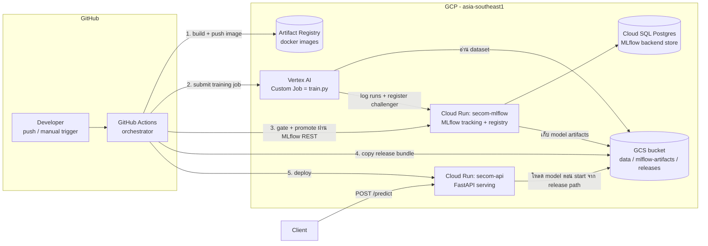
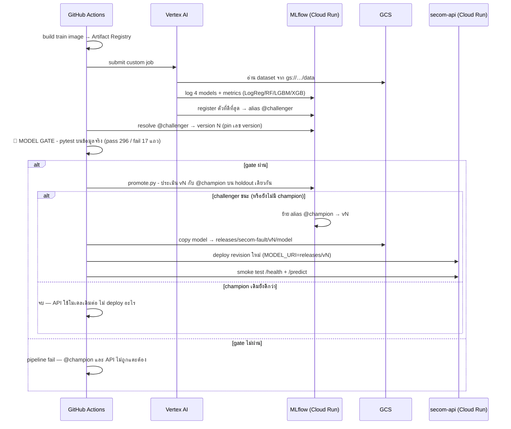

# SECOM Fault Detection — MLOps Pipeline บน GCP

คู่มือนี้คือ **source of truth** สำหรับย้าย pipeline จากการรันบนเครื่อง local ไปรันบน GCP ทั้งหมด
พร้อมเพิ่มความสามารถ 3 อย่างตามโจทย์:

| # | ความต้องการ | Implement ที่ไหน |
|---|------------|------------------|
| 1 | **Champion/Challenger** — เทรนใหม่แล้วถ้าได้โมเดลดีกว่า ให้ API สลับไปใช้ตัวใหม่อัตโนมัติ | `src/train.py` (register best เป็น `@challenger`) + `src/promote.py` (เทียบกับ `@champion` แล้ว promote) + job `deploy-api` ใน workflow |
| 2 | **Model gate** — โมเดลต้องผ่าน unit test บน**ข้อมูลจริง** (มีทั้ง label ดี/เสีย) ก่อนถูกใช้ผ่าน API | `tests/gate/test_model_gate.py` รันใน GitHub Actions **คั่นระหว่าง** เทรนกับ deploy — gate ไม่ผ่าน = ไม่มีอะไรถูก deploy |
| 3 | **รันบน cloud** — GitHub Actions + Vertex AI + MLflow บน Cloud Run + GCS bucket | ทั้งหมดตามแผนที่คุณคิดไว้ + เพิ่มบางชิ้นที่จำเป็น (ดูตารางถัดไป) |

สิ่งที่**เพิ่มจากแผนเดิมของคุณ** เพราะจำเป็นต่อการทำงานจริง:

| เพิ่มอะไร | ทำไมถึงจำเป็น |
|-----------|---------------|
| **Cloud SQL (Postgres)** | MLflow server ต้องมี backend database — ถ้าใช้ SQLite ในตัว container ข้อมูล run/model registry จะ**หายทุกครั้งที่ Cloud Run restart** (ซึ่ง scale-to-zero restart บ่อยมาก) |
| **Artifact Registry** | ที่เก็บ Docker image (train / api / mlflow) — Vertex AI และ Cloud Run ต้อง pull image จากที่นี่ |
| **Workload Identity Federation (WIF)** | ให้ GitHub Actions ยืนยันตัวกับ GCP แบบ **ไม่ต้องมี service account key** — ไม่มี secret รั่วได้เพราะไม่มี secret ให้รั่ว |
| **Secret Manager** | เก็บรหัสผ่าน database ของ MLflow (สิ่งเดียวในระบบที่เป็น secret จริง ๆ) |
| **Release bundle ใน GCS** | ตอน deploy จะ copy โมเดล champion ไปที่ path ตายตัว `gs://…/releases/v{N}/` แล้วให้ API โหลดจากตรงนั้น — API **ไม่ต้องพึ่ง MLflow ตอน runtime** (เหตุผลเต็มอยู่ใน §1.3) |

---

## สารบัญ

1. [สถาปัตยกรรมและเหตุผลการตัดสินใจ](#1-สถาปัตยกรรมและเหตุผลการตัดสินใจ)
2. [โครงสร้าง repo เป้าหมาย](#2-โครงสร้าง-repo-เป้าหมาย)
3. [Phase 0 — เตรียม GCP project (ครั้งเดียว)](#3-phase-0--เตรียม-gcp-project-ครั้งเดียว)
4. [Phase 1 — แก้ไฟล์ที่มีอยู่แล้ว](#4-phase-1--แก้ไฟล์ที่มีอยู่แล้ว)
5. [Phase 2 — ไฟล์ใหม่ทั้งหมด](#5-phase-2--ไฟล์ใหม่ทั้งหมด)
6. [Phase 3 — Deploy MLflow server (ครั้งเดียว)](#6-phase-3--deploy-mlflow-server-ครั้งเดียว)
7. [Phase 4 — เชื่อม GitHub แล้วรัน pipeline ครั้งแรก](#7-phase-4--เชื่อม-github-แล้วรัน-pipeline-ครั้งแรก)
8. [การใช้งานประจำวัน](#8-การใช้งานประจำวัน)
9. [Model gate — วิธีคิดและการปรับ threshold](#9-model-gate--วิธีคิดและการปรับ-threshold)
10. [สิ่งที่ควรทำต่อ (future work)](#10-สิ่งที่ควรทำต่อ-future-work)
11. [Troubleshooting](#11-troubleshooting)

---

## 1. สถาปัตยกรรมและเหตุผลการตัดสินใจ

### 1.1 ภาพรวม



### 1.2 ลำดับการทำงานของ pipeline (ทุกครั้งที่ push โค้ดเทรน / กด trigger)



### 1.3 เหตุผลของการตัดสินใจเชิงสถาปัตยกรรม

| จุดตัดสินใจ | เลือก | เหตุผล | ทางเลือกที่ไม่เลือก (และทำไม) |
|---|---|---|---|
| ที่รันเทรน | **Vertex AI Custom Job** | ตามที่คุณคิดไว้ — ถูกต้องแล้ว: แยก compute หนักออกจาก CI, จ่ายตามวินาทีที่ใช้ (SECOM เทรน ~5-10 นาที ≈ $0.02/รอบ), เห็น job history ใน console, อนาคตเพิ่ม GPU ได้ด้วยการแก้ 1 บรรทัด | *Cloud Run Jobs* — ง่ายกว่าเล็กน้อยและใช้ image เดียวกันได้เลย แต่ไม่ใช่ ML-native (ไม่มี job lineage ฝั่ง ML) / *รันใน GitHub runner* — ผูก compute กับ CI, runner ฟรีมี 2 core + จำกัด 6 ชม. |
| Tracking + Registry | **MLflow server บน Cloud Run + Cloud SQL + GCS** | ตามแผนคุณ + เพิ่ม Cloud SQL เพราะ state ต้องอยู่รอด restart; artifact เก็บ GCS ผ่าน `--artifacts-destination` (client ไม่ต้องมีสิทธิ์เขียน bucket — server เขียนแทน = ล็อกสิทธิ์ได้แคบ) | *Vertex AI Model Registry* — ผูกกับ Vertex แน่นและไม่มี experiment UI แบบ MLflow ที่คุณใช้อยู่แล้ว |
| ความหมาย champion/challenger | **MLflow Registry aliases** (`@champion`, `@challenger`) | เป็นวิธีมาตรฐานของ MLflow ≥ 2.9 — alias ชี้ version ได้ตัวเดียว, ย้าย atomic, เก็บประวัติทุก version ไว้ rollback | *Model Stages (Staging/Production)* — **deprecated แล้ว** ใน MLflow รุ่นใหม่ |
| จุดรัน model gate | **pytest ใน GitHub Actions หลังเทรน-ก่อน promote** | gate เป็น "ด่าน" อยู่บนเส้นทางเดียวที่โมเดลจะไป production ได้ → บังคับโดยโครงสร้าง workflow (job `promote`/`deploy` ต้อง `needs: gate`), ผลเห็นชัดใน Actions UI ว่า fail ข้อไหน | *รัน gate ในสคริปต์เทรน* — คนเทรนตรวจการบ้านตัวเอง แยก concern ไม่ขาด และข้ามได้ง่าย |
| วิธีให้ API ได้โมเดล | **Release bundle: copy โมเดล champion ไป `gs://…/releases/v{N}/` แล้ว pin path นั้นเป็น env var ของ Cloud Run revision** | (1) Cloud Run scale-to-zero: ถ้า API ต้องถาม MLflow ทุก cold start จะเกิด cold start ซ้อนสองชั้นและเพิ่มจุดพัง (2) 1 revision = 1 โมเดล ตายตัว → รู้เสมอว่า revision ไหนใช้โมเดลอะไร, rollback = ย้าย traffic กลับ revision เก่า (3) MLflow ล่มก็ไม่กระทบ API | *API โหลด `models:/…@champion` ตอน start* — สะดวกแต่ mutable (alias ขยับได้ใต้เท้า) และผูก availability ของ API กับ MLflow |
| Auth: GitHub → GCP | **Workload Identity Federation** | ไม่มี key ให้ leak, สิทธิ์จำกัดเฉพาะ repo ที่ระบุ | *Service account key ใน GitHub secrets* — key อายุยาว หมุนเวียนยาก เป็นช่องโหว่คลาสสิก |
| Data versioning | **GCS bucket + object versioning** | dataset 5 MB นิ่ง ๆ ไฟล์เดียว — versioning ของ GCS พอ และ hash ข้อมูลถูก tag ลงทุก run/model version เพื่อ lineage | *DVC* — overkill สำหรับ dataset เดียวขนาดนี้ (ใส่ทีหลังได้ถ้า data โตขึ้น) |
| Metric หลักในการเลือก/เทียบโมเดล | **PR-AUC** | SECOM imbalanced หนัก (fault 104/1567 = 6.6%) — PR-AUC สะท้อนคุณภาพบน minority class ตรงกว่า ROC-AUC และไม่ขึ้นกับ threshold | *Accuracy* — โมเดลทายว่า "pass ทุกชิ้น" ได้ accuracy 93% ทั้งที่ไร้ประโยชน์ |

### 1.4 ค่าใช้จ่ายโดยประมาณ (ใช้งานระดับโปรเจกต์เรียน)

| รายการ | ประมาณ/เดือน |
|---|---|
| Cloud SQL `db-f1-micro` + SSD 10 GB | ~$10–13 ← **ก้อนใหญ่สุด** |
| Cloud Run ×2 (scale-to-zero, ทราฟฟิกเดโม่) | ~$0–1 |
| Vertex AI `e2-standard-4` (~10 นาที/รอบเทรน) | ~$0.02–0.05 ต่อรอบ |
| GCS + Artifact Registry | <$1 |
| **รวม** | **~$12–16/เดือน** (ฟรีถ้าอยู่ใน free trial credit $300) |

> **โหมดประหยัด:** ค่าใช้จ่ายเกือบทั้งหมดคือ Cloud SQL ซึ่ง scale-to-zero ไม่ได้
> ทางเลือก: ใช้ Postgres ฟรีจากภายนอก (เช่น Neon / Supabase free tier) แล้วชี้
> `--backend-store-uri` ไปที่นั่นแทน — โค้ดทุกอย่างเหมือนเดิม เหลือค่าใช้จ่าย ~$1/เดือน
> (แลกกับ data อยู่นอก GCP) และ**อย่าลืมลบ Cloud SQL / ปิด project หลังจบวิชา**

---

## 2. โครงสร้าง repo เป้าหมาย

```
secom-ml-pipeline/
├── README.md                      🆕 ไฟล์นี้
├── conftest.py                    🆕 ให้ pytest หา src/ เจอ
├── pytest.ini                     🆕 ประกาศ marker "gate"
├── requirements.txt               ✏️ เขียนใหม่ (เดิมเป็น UTF-16 + ขาด lib สำคัญ)
├── requirements-dev.txt           🆕 pytest + ruff
├── .env.example                   🆕 ตัวอย่าง env สำหรับ local dev
├── .gitignore                     🆕
├── .dockerignore                  🆕
├── pipeline.py                    ❌ ลบ (โค้ดเก่าซ้ำกับ src/ และรันไม่ได้อยู่แล้ว)
├── mlflow.db, mlartifacts/        ❌ ไม่ commit — เป็นของ MLflow local เท่านั้น (อยู่ใน .gitignore)
├── secom/                         ⬜ dataset (ไม่ commit — source of truth คือ GCS)
├── src/
│   ├── __init__.py                🆕 ทำให้ src เป็น package (สำคัญต่อ pickle — ดู §4)
│   ├── config.py                  ✏️ เพิ่ม settings ของ gate/promotion/GCS
│   ├── data.py                    ✏️ อ่าน gs:// ได้ + data fingerprint
│   ├── preprocess.py              ✏️ แก้ import 1 บรรทัด
│   ├── models.py                  ✏️ แก้ import 1 บรรทัด
│   ├── evaluate.py                ✏️ แก้ import 1 บรรทัด
│   ├── train.py                   ✏️ เพิ่มการเลือก best model + register @challenger
│   ├── tune.py                    ✏️ แก้ import + auth (3 จุดเล็ก)
│   ├── gcp_auth.py                🆕 จัดการ ID token สำหรับคุยกับ MLflow บน Cloud Run
│   └── promote.py                 🆕 ตรรกะ champion vs challenger
├── scripts/
│   ├── __init__.py                🆕
│   └── resolve_version.py         🆕 แปลง alias → เลข version (pin ไว้ทั้ง pipeline)
├── api/
│   ├── __init__.py                🆕
│   ├── main.py                    🆕 FastAPI serving
│   └── requirements.txt           🆕
├── tests/
│   ├── unit/
│   │   ├── test_data.py           🆕 ┐
│   │   ├── test_preprocess.py     🆕 ├ รันทุก push (ไม่แตะ cloud)
│   │   └── test_evaluate.py       🆕 ┘
│   └── gate/
│       └── test_model_gate.py     🆕 ด่านตรวจโมเดลบนข้อมูลจริง (ความต้องการข้อ 2)
├── docker/
│   ├── train.Dockerfile           🆕 image สำหรับ Vertex AI
│   ├── api.Dockerfile             🆕 image สำหรับ serving
│   └── mlflow/
│       ├── Dockerfile             🆕 MLflow server + postgres driver + GCS lib
│       └── entrypoint.sh          🆕
└── .github/workflows/
    ├── ci.yml                     🆕 lint + unit tests ทุก push/PR
    └── train-deploy.yml           🆕 train → gate → promote → deploy
```

---

## 3. Phase 0 — เตรียม GCP project (ครั้งเดียว)

> รันใน **Cloud Shell** (ปุ่ม `>_` มุมขวาบนของ GCP console) — เป็น bash และมี gcloud พร้อมใช้
> ยกเว้นขั้น **upload dataset** ที่ต้องรันจากเครื่องตัวเอง (ไฟล์อยู่ในเครื่อง)

### 3.1 ตั้งตัวแปรพื้นฐาน

```bash
export PROJECT_ID=$(gcloud config get-value project)
export PROJECT_NUMBER=$(gcloud projects describe $PROJECT_ID --format='value(projectNumber)')
export REGION=asia-southeast1              # สิงคโปร์ — ใกล้ไทยสุดที่มีครบทั้ง Vertex/Run/SQL
export BUCKET=${PROJECT_ID}-secom-mlops
export GH_REPO="<GITHUB_USER>/<REPO_NAME>" # 🔴 แก้เป็น repo จริงของคุณ เช่น linkpittawat/secom-ml-pipeline
```

### 3.2 เปิด API ที่ต้องใช้

```bash
gcloud services enable \
  run.googleapis.com aiplatform.googleapis.com \
  artifactregistry.googleapis.com sqladmin.googleapis.com \
  secretmanager.googleapis.com cloudbuild.googleapis.com \
  iamcredentials.googleapis.com sts.googleapis.com
```

### 3.3 สร้าง bucket + เปิด versioning + สร้าง Artifact Registry

```bash
gcloud storage buckets create gs://$BUCKET --location=$REGION --uniform-bucket-level-access
gcloud storage buckets update gs://$BUCKET --versioning   # เผื่อ data เปลี่ยน ย้อนดูของเก่าได้

gcloud artifacts repositories create secom \
  --repository-format=docker --location=$REGION \
  --description="SECOM MLOps images"
```

**Upload dataset — รันจากเครื่องตัวเอง (PowerShell ในโฟลเดอร์โปรเจกต์):**

```powershell
gcloud storage cp "secom/secom.data" "secom/secom_labels.data" gs://<PROJECT_ID>-secom-mlops/data/
```

โครงสร้างใน bucket ที่จะเกิดขึ้นทั้งหมด:

```
gs://<PROJECT_ID>-secom-mlops/
├── data/                 ← dataset (source of truth — ทุก environment อ่านจากที่นี่)
├── mlflow-artifacts/     ← MLflow server เขียน model artifacts ทุก run
└── releases/             ← bundle ของ champion แต่ละ version ที่ถูก deploy จริง
```

### 3.4 Service accounts + สิทธิ์ (หลัก least-privilege)

| Service account | ใช้โดย | สิทธิ์ | ทำไม |
|---|---|---|---|
| `gha-deployer` | GitHub Actions | aiplatform.user, run.admin, artifactregistry.writer, storage.objectAdmin (bucket), actAs runtime SAs, run.invoker (mlflow) | คนสั่งงานทั้ง pipeline |
| `vertex-train` | Training job บน Vertex | storage.objectViewer (bucket), run.invoker (mlflow) | อ่าน data + log ไป MLflow — **เขียน bucket ตรง ๆ ไม่ได้** (artifact ผ่าน MLflow server) |
| `mlflow-server` | Cloud Run secom-mlflow | storage.objectAdmin (bucket), cloudsql.client, secretAccessor | ตัวเดียวที่เขียน artifacts ลง bucket |
| `secom-api-run` | Cloud Run secom-api | storage.objectViewer (bucket) | อ่าน release bundle อย่างเดียว — โดน compromise ก็ทำอะไรไม่ได้ |

```bash
for SA in gha-deployer vertex-train mlflow-server secom-api-run; do
  gcloud iam service-accounts create $SA --display-name="$SA"
done

SA() { echo "$1@${PROJECT_ID}.iam.gserviceaccount.com"; }

# --- mlflow-server ---
gcloud storage buckets add-iam-policy-binding gs://$BUCKET \
  --member="serviceAccount:$(SA mlflow-server)" --role=roles/storage.objectAdmin
gcloud projects add-iam-policy-binding $PROJECT_ID \
  --member="serviceAccount:$(SA mlflow-server)" --role=roles/cloudsql.client

# --- vertex-train ---
gcloud storage buckets add-iam-policy-binding gs://$BUCKET \
  --member="serviceAccount:$(SA vertex-train)" --role=roles/storage.objectViewer

# --- secom-api-run ---
gcloud storage buckets add-iam-policy-binding gs://$BUCKET \
  --member="serviceAccount:$(SA secom-api-run)" --role=roles/storage.objectViewer

# --- gha-deployer ---
gcloud projects add-iam-policy-binding $PROJECT_ID \
  --member="serviceAccount:$(SA gha-deployer)" --role=roles/aiplatform.user
gcloud projects add-iam-policy-binding $PROJECT_ID \
  --member="serviceAccount:$(SA gha-deployer)" --role=roles/run.admin
gcloud artifacts repositories add-iam-policy-binding secom --location=$REGION \
  --member="serviceAccount:$(SA gha-deployer)" --role=roles/artifactregistry.writer
gcloud storage buckets add-iam-policy-binding gs://$BUCKET \
  --member="serviceAccount:$(SA gha-deployer)" --role=roles/storage.objectAdmin
# GitHub Actions ต้อง "สวมบท" (actAs) runtime SA ตอน submit vertex job / deploy cloud run
for RUNTIME in vertex-train secom-api-run; do
  gcloud iam service-accounts add-iam-policy-binding $(SA $RUNTIME) \
    --member="serviceAccount:$(SA gha-deployer)" --role=roles/iam.serviceAccountUser
done
```

> สิทธิ์ `run.invoker` บน service `secom-mlflow` (สำหรับ `gha-deployer` + `vertex-train`)
> จะผูกได้หลัง deploy MLflow แล้ว → ทำใน Phase 3

### 3.5 Cloud SQL สำหรับ MLflow backend (ใช้เวลาสร้าง ~10 นาที)

```bash
gcloud sql instances create mlflow-pg \
  --database-version=POSTGRES_16 --tier=db-f1-micro \
  --region=$REGION --storage-size=10

gcloud sql databases create mlflow --instance=mlflow-pg

# รหัสผ่านเป็น secret เดียวของทั้งระบบ — เก็บใน Secret Manager ไม่เก็บในโค้ด/ENV file
export DB_PASS=$(openssl rand -hex 16)
gcloud sql users create mlflow --instance=mlflow-pg --password="$DB_PASS"
echo -n "$DB_PASS" | gcloud secrets create mlflow-db-pass --data-file=-
gcloud secrets add-iam-policy-binding mlflow-db-pass \
  --member="serviceAccount:mlflow-server@${PROJECT_ID}.iam.gserviceaccount.com" \
  --role=roles/secretmanager.secretAccessor
```

### 3.6 Workload Identity Federation (GitHub Actions → GCP แบบไม่มี key)

```bash
gcloud iam workload-identity-pools create github \
  --location=global --display-name="GitHub Actions"

# attribute-condition ล็อกให้เฉพาะ repo ของเราเท่านั้นที่ยืม identity นี้ได้
gcloud iam workload-identity-pools providers create-oidc github-oidc \
  --location=global --workload-identity-pool=github \
  --issuer-uri="https://token.actions.githubusercontent.com" \
  --attribute-mapping="google.subject=assertion.sub,attribute.repository=assertion.repository" \
  --attribute-condition="assertion.repository=='${GH_REPO}'"

gcloud iam service-accounts add-iam-policy-binding \
  gha-deployer@${PROJECT_ID}.iam.gserviceaccount.com \
  --role=roles/iam.workloadIdentityUser \
  --member="principalSet://iam.googleapis.com/projects/${PROJECT_NUMBER}/locations/global/workloadIdentityPools/github/attribute.repository/${GH_REPO}"

# ค่านี้ต้องเอาไปตั้งเป็น GitHub variable ชื่อ WIF_PROVIDER (Phase 4)
echo "WIF_PROVIDER = projects/${PROJECT_NUMBER}/locations/global/workloadIdentityPools/github/providers/github-oidc"
```

---

## 4. Phase 1 — แก้ไฟล์ที่มีอยู่แล้ว

> ⚠️ **การเปลี่ยนแปลงเชิงพฤติกรรมที่สำคัญที่สุดของ Phase นี้:**
> เดิมโค้ดรันด้วย `cd src && python train.py` → import กันแบบ `from config import …`
> ต่อไปนี้ **ต้องรันจาก root ของ repo ด้วย `python -m src.train`** และ import เป็น `from src.config import …`
>
> **เหตุผล (สำคัญมาก อย่าข้าม):** โมเดลถูก serialize ด้วย pickle ซึ่งบันทึก *ชื่อ module* ของคลาส
> `SimplePreprocessor` ติดไปด้วย ถ้าตอนเทรน import แบบ `preprocess.SimplePreprocessor` แต่ตอน serve
> โค้ดหาได้ในชื่อ `src.preprocess.SimplePreprocessor` → **โหลดโมเดลพังทันที** (`ModuleNotFoundError`)
> การบังคับให้ทุก environment (local / Vertex / CI / API) ใช้ path เดียวกันคือ `src.*` ตัดปัญหานี้ทิ้งถาวร

### 4.1 `requirements.txt` — เขียนใหม่ทั้งไฟล์

ปัญหาของไฟล์เดิม:
1. **เป็น UTF-16** (เกิดจาก `pip freeze > requirements.txt` บน PowerShell) — `pip install -r` บน Linux/Docker จะอ่านไม่ได้
2. ขาด lib ที่ใช้จริง (mlflow, optuna, pydantic-settings) และมี lib ที่ไม่เกี่ยวกับการเทรน (jupyter, matplotlib ฯลฯ)

หลักการ pin: **กลุ่ม model stack ต้อง pin เป๊ะและตรงกันทุก environment** เพราะโมเดลถูก
serialize/deserialize ด้วย cloudpickle — ต่างเวอร์ชัน = โหลดพังหรือพฤติกรรมเพี้ยนแบบเงียบ ๆ

#### 📄 `requirements.txt`

```text
# ===== model stack — pin เป๊ะ ห้ามต่างกันระหว่าง train / CI-gate / API =====
# เหตุผล: โมเดล = pickle ของ object จาก lib พวกนี้ เวอร์ชันต้องตรงกันตอนโหลดกลับ
numpy==2.2.6
pandas==2.3.3
scikit-learn==1.7.2
lightgbm==4.6.0
xgboost==3.2.0
cloudpickle==3.1.2
mlflow==3.14.0

# ===== training-only =====
optuna==4.9.0
pydantic-settings==2.14.2

# ===== I/O กับ GCP =====
gcsfs>=2025.3.0,<2027       # ให้ pandas.read_csv("gs://...") ได้ตรง ๆ
google-cloud-storage>=2.19  # mlflow ใช้อ่าน/เขียน artifact บน gs://
google-auth>=2.38
requests>=2.32              # gcp_auth.py ใช้คุยกับ metadata server
```

> ถ้าอยากสร้างจาก venv จริงในอนาคต บน PowerShell ใช้
> `pip freeze | Out-File -Encoding utf8 requirements.txt` (อย่าใช้ `>` เฉย ๆ — ได้ UTF-16 อีก)

### 4.2 `src/config.py` — แทนที่ทั้งไฟล์

สิ่งที่เปลี่ยนและทำไม:
- `data_dir` เปลี่ยนจาก `Path` → `str` : `Path("gs://bucket")` จะโดน normalize เป็น `gs:/bucket` (พัง) — เก็บเป็น string แล้วให้ pandas+gcsfs จัดการเอง
- ค่า default ของ `data_dir` เปลี่ยนจาก `../secom` → `secom` : เพราะย้ายมารันจาก root (`python -m src.train`)
- เพิ่มกลุ่ม **champion/challenger** และ **model gate** : เก็บ threshold ทั้งหมดไว้ที่เดียว override ได้ผ่าน env (`SECOM_GATE_MIN_RECALL_FAULT=0.4` ฯลฯ) โดยไม่ต้องแก้โค้ด

#### 📄 `src/config.py`

```python
"""
Config กลางของทั้งระบบ — ทุกค่า override ได้ด้วย env ที่ขึ้นต้น SECOM_ (หลัก 12-factor)
=> โค้ดชุดเดียวกันรันได้ทั้ง local / GitHub Actions / Vertex AI / Cloud Run
   โดย "เปลี่ยนแค่ env" ไม่ต้องแตะโค้ด เช่น
   - local:     SECOM_DATA_DIR=secom, SECOM_MLFLOW_URI=http://127.0.0.1:5000
   - บน cloud:  SECOM_DATA_DIR=gs://<bucket>/data, SECOM_MLFLOW_URI=https://secom-mlflow-xxx.run.app
"""
from pydantic_settings import BaseSettings, SettingsConfigDict


class Settings(BaseSettings):
    model_config = SettingsConfigDict(
        env_prefix="SECOM_", env_file=".env", extra="ignore"
    )

    random_state: int = 42

    # ── data ──────────────────────────────────────────────────────────────
    # เป็น str ไม่ใช่ Path เพราะต้องรองรับ "gs://bucket/data"
    # (Path จะ normalize gs:// เหลือ gs:/ ทำให้ gcsfs ไม่รู้จัก)
    data_dir: str = "secom"
    test_size: float = 0.2

    # ── preprocessing ────────────────────────────────────────────────────
    corr_threshold: float = 0.95
    var_threshold: float = 1e-5
    decision_threshold: float = 0.5

    # ── MLflow ───────────────────────────────────────────────────────────
    mlflow_uri: str = "http://127.0.0.1:5000"
    experiment: str = "SECOM_fault_Detection"
    registered_model_name: str = "secom-fault"
    champion_alias: str = "champion"      # โมเดลที่ API ใช้อยู่จริง
    challenger_alias: str = "challenger"  # best model ของรอบเทรนล่าสุด (ผู้ท้าชิง)

    # ── model selection / promotion ──────────────────────────────────────
    # PR_AUC เป็น metric หลักเพราะ SECOM imbalanced หนัก (fault ~6.6%)
    primary_metric: str = "PR_AUC"
    # challenger ต้องชนะ champion อย่างน้อยเท่านี้ถึงจะ promote
    # กันการสลับโมเดลไปมา (churn) จาก noise เล็ก ๆ น้อย ๆ ของการวัด
    promote_min_delta: float = 0.002

    # ── model gate (ด่านก่อน deploy — ดู tests/gate/) ────────────────────
    # ค่าพวกนี้คือ "floor กันโมเดลพัง" ไม่ใช่เป้าหมายคุณภาพ:
    # ตั้งต่ำพอที่โมเดลปกติผ่านสบาย แต่โมเดลเพี้ยน (ทายคลาสเดียวล้วน,
    # แย่กว่าสุ่ม) ต้องตกแน่ ๆ — ปรับได้ผ่าน env เช่น SECOM_GATE_MIN_PR_AUC=0.2
    gate_min_recall_fault: float = 0.25   # จับ fault จริงได้อย่างน้อย 25% (>=5 จาก 17 ชิ้น)
    gate_min_specificity: float = 0.60    # ไม่เหมาโรงงานทั้งโรงว่าเสีย
    gate_min_pr_auc: float = 0.10         # base rate ~0.066 → โมเดลสุ่มได้ ~0.07
    gate_min_roc_auc: float = 0.60        # โมเดลสุ่มได้ 0.5

    @property
    def data_file(self) -> str:
        return f"{self.data_dir}/secom.data"

    @property
    def labels_file(self) -> str:
        return f"{self.data_dir}/secom_labels.data"


settings = Settings()
```

### 4.3 `src/data.py` — แทนที่ทั้งไฟล์

สิ่งที่เปลี่ยน: (1) import เป็น `src.config` (2) path เป็น str เพื่อรองรับ `gs://`
(3) เพิ่ม `data_fingerprint()` สำหรับ lineage — logic เดิม (`load_raw`/`chronological_split`) ไม่เปลี่ยน

#### 📄 `src/data.py`

```python
import hashlib

import fsspec
import pandas as pd
from sklearn.model_selection import train_test_split

from src.config import settings


def load_raw(
    data_path: str | None = None,
    labels_path: str | None = None,
) -> tuple[pd.DataFrame, pd.Series]:
    """โหลด features + labels — path เป็น local ("secom/...") หรือ GCS ("gs://...") ก็ได้

    pandas อ่าน gs:// ได้ตรง ๆ ผ่าน gcsfs โดยใช้ Application Default Credentials:
    - บน Vertex AI / Cloud Run  → service account ที่ผูกกับ job/service
    - บน GitHub Actions        → identity จาก Workload Identity Federation
    - บนเครื่อง local          → `gcloud auth application-default login`
    จึงไม่ต้องมีโค้ด auth ใด ๆ ตรงนี้เลย
    """
    data_path = str(data_path or settings.data_file)
    labels_path = str(labels_path or settings.labels_file)

    X = pd.read_csv(data_path, sep=r"\s+", header=None)

    raw = pd.read_csv(labels_path, sep=r"\s+", header=None)
    y = raw[0].replace(-1, 0).astype(int)  # ไฟล์ต้นทาง: -1 = pass, 1 = fail → map เป็น 0/1
    y.name = "label"

    if X.shape[0] != y.shape[0]:
        raise ValueError(
            f"row mismatch: features={X.shape[0]} labels={y.shape[0]}"
        )
    return X, y


def chronological_split(
    X: pd.DataFrame, y: pd.Series, test_size: float | None = None
):
    """Forward-in-time split. NEVER shuffle — จะทำให้เกิด temporal leakage.

    หมายเหตุ MLOps: split นี้ deterministic (ข้อมูลเดิม → holdout เดิมเป๊ะ)
    ทำให้ train / gate / promote ที่รันคนละเครื่องคนละเวลา
    เห็น test set ชุดเดียวกันเสมอ → ตัวเลขเทียบกันได้จริง
    """
    test_size = settings.test_size if test_size is None else test_size
    return train_test_split(X, y, test_size=test_size, shuffle=False)


def data_fingerprint(
    data_path: str | None = None, labels_path: str | None = None
) -> str:
    """md5 (ย่อ 12 ตัว) ของไฟล์ data+labels — ใช้ tag ลง MLflow run/model version

    เหตุผล: การเปรียบเทียบ champion vs challenger จะแฟร์ก็ต่อเมื่อวัดบนข้อมูลชุดเดียวกัน
    fingerprint ทำให้ตรวจย้อนหลังได้เสมอว่าโมเดลไหนเทรน/ถูกวัดบนข้อมูลชุดไหน (lineage)
    """
    data_path = str(data_path or settings.data_file)
    labels_path = str(labels_path or settings.labels_file)
    h = hashlib.md5()
    for p in (data_path, labels_path):
        with fsspec.open(p, "rb") as f:  # fsspec เปิดได้ทั้ง local และ gs://
            h.update(f.read())
    return h.hexdigest()[:12]
```

### 4.4 `src/train.py` — แทนที่ทั้งไฟล์

สิ่งที่เปลี่ยนจากเดิมและทำไม:

| เดิม | ใหม่ | เหตุผล |
|---|---|---|
| `register=True` จะ register **ทุกโมเดล** (4 ตัว/รอบ) | register เฉพาะ **ตัวที่ดีที่สุดของรอบ** แล้วตั้ง alias `@challenger` | registry คือรายชื่อ "ผู้เข้าชิง production" ไม่ใช่ log — ตัวแพ้ในรอบยังดูได้จาก experiment runs |
| `predict_proba(...)[:, 1]` | `predict_positive_proba()` | กันเคสโมเดลเห็นคลาสเดียว (คุณเขียน helper นี้ไว้แล้วใน evaluate.py — เอามาใช้จริง) |
| ไม่มี lineage | tag `git_sha` + `data_hash` ทุก run/version | ตอบคำถาม "โมเดลใน prod มาจากโค้ด commit ไหน ข้อมูลชุดไหน" ได้เสมอ |
| set tracking URI ตรง ๆ | ผ่าน `configure_mlflow()` | รวมเรื่อง auth กับ Cloud Run ไว้ที่เดียว (`src/gcp_auth.py`) |
| — | เพิ่ม `signature` + `input_example` ตอน log model | MLflow ใช้ตรวจ schema ตอน serve + เป็นเอกสารในตัว |

#### 📄 `src/train.py`

```python
import argparse
import math
import os
import subprocess

import mlflow
from mlflow.models import infer_signature
from mlflow.tracking import MlflowClient
from sklearn.pipeline import Pipeline

from src.config import settings
from src.data import chronological_split, data_fingerprint, load_raw
from src.evaluate import compute_metrics, predict_positive_proba
from src.gcp_auth import configure_mlflow
from src.models import LOGGED_PARAMS, make_models
from src.preprocess import SimplePreprocessor


def build_pipeline(model) -> Pipeline:
    # preprocessor อยู่ "ใน" pipeline เดียวกับโมเดลเสมอ
    # => ตอน serve ส่งข้อมูลดิบ 590 คอลัมน์ (มี NaN ได้) เข้ามาได้เลย
    #    และ preprocessing fit บน train fold เท่านั้นโดยอัตโนมัติ ไม่มีทาง leak
    return Pipeline([("pre", SimplePreprocessor()), ("clf", model)])


def _log_params(model) -> None:
    if hasattr(model, "get_params"):
        p = model.get_params()
        mlflow.log_params({k: v for k, v in p.items() if k in LOGGED_PARAMS})


def _git_sha() -> str:
    """commit ที่ใช้เทรน — บน CI/Vertex ส่งผ่าน env GIT_SHA (ใน image ไม่มี .git)
    บนเครื่อง dev ถามจาก git ตรง ๆ"""
    sha = os.getenv("GIT_SHA")
    if sha:
        return sha[:12]
    try:
        out = subprocess.check_output(["git", "rev-parse", "HEAD"], text=True)
        return out.strip()[:12]
    except Exception:
        return "unknown"


def train_all(register: bool = False) -> dict:
    """เทรนโมเดลผู้สมัครทุกตัว → log ลง MLflow → (ถ้า register) ลงทะเบียน
    "ตัวที่ดีที่สุดของรอบนี้" เป็น @challenger เพื่อรอเข้าด่าน gate + ชิง champion ต่อไป
    """
    configure_mlflow()  # auth (ถ้าจำเป็น) + tracking uri + experiment

    X, y = load_raw()
    X_train, X_test, y_train, y_test = chronological_split(X, y)
    lineage_tags = {"git_sha": _git_sha(), "data_hash": data_fingerprint()}

    results: dict[str, dict] = {}
    best: tuple[float, str, str] | None = None  # (score, ชื่อ algo, model_uri)

    for name, model in make_models().items():
        pipe = build_pipeline(model)
        with mlflow.start_run(run_name=name):
            mlflow.set_tags(lineage_tags)
            _log_params(model)

            pipe.fit(X_train, y_train)
            proba = predict_positive_proba(pipe, X_test)

            metrics = compute_metrics(y_test, proba, settings.decision_threshold)
            mlflow.log_metrics(metrics)

            info = mlflow.sklearn.log_model(
                pipe,
                name="model",
                # MLflow 3.x เปลี่ยน default เป็น "skops" ซึ่ง serialize custom class
                # (SimplePreprocessor ของเรา) ไม่ได้ → ต้องบังคับ cloudpickle
                serialization_format="cloudpickle",
                # signature + input_example = สัญญา (contract) ของ input:
                # 590 คอลัมน์ float มี NaN ได้ — คนโหลดโมเดลไปใช้เห็นทันทีว่าต้องป้อนอะไร
                signature=infer_signature(X_test.head(5), proba[:5]),
                input_example=X_test.head(3),
            )

            results[name] = metrics
            print(f"[{name}] " + "  ".join(f"{k}={v:.4f}" for k, v in metrics.items()))

            # เลือก best ด้วย primary metric; nan (test window มีคลาสเดียว) หมดสิทธิ์
            score = metrics.get(settings.primary_metric)
            if score is not None and not math.isnan(score):
                if best is None or score > best[0]:
                    best = (score, name, info.model_uri)

    if register:
        if best is None:
            raise RuntimeError(
                f"ทุกโมเดลได้ {settings.primary_metric} = nan — "
                "test window อาจมีคลาสเดียว เช็คข้อมูล/การ split ก่อน"
            )
        score, algo, model_uri = best
        # register เฉพาะ best-of-run ตัวเดียว → เป็นผู้ท้าชิง (@challenger)
        # การตัดสินว่าได้ขึ้น @champion หรือไม่ เป็นหน้าที่ของ src/promote.py
        # (หลังผ่าน model gate แล้วเท่านั้น — ดู .github/workflows/train-deploy.yml)
        mv = mlflow.register_model(model_uri, settings.registered_model_name)
        client = MlflowClient()
        client.set_registered_model_alias(
            settings.registered_model_name, settings.challenger_alias, mv.version
        )
        for k, v in {**lineage_tags, "algo": algo,
                     settings.primary_metric: f"{score:.4f}"}.items():
            client.set_model_version_tag(
                settings.registered_model_name, mv.version, k, str(v)
            )
        print(f"registered challenger: v{mv.version} ({algo}, "
              f"{settings.primary_metric}={score:.4f})")

    return results


if __name__ == "__main__":
    parser = argparse.ArgumentParser()
    parser.add_argument(
        "--register", action="store_true",
        help="ลงทะเบียน best model ของรอบนี้เป็น @challenger (ใช้ตอนรันบน Vertex)",
    )
    train_all(register=parser.parse_args().register)
```

### 4.5 `src/preprocess.py`, `src/models.py`, `src/evaluate.py` — แก้ import อย่างเดียว

ทั้ง 3 ไฟล์ แก้บรรทัดเดียวกัน (logic ทั้งหมดคงเดิม — ดีอยู่แล้ว):

```diff
-from config import settings
+from src.config import settings
```

> ใน `evaluate.py` มีบล็อก `compute_metrics` เก่าที่ comment ทิ้งไว้ (บรรทัด 12–22) — ลบทิ้งได้เลย

### 4.6 `src/tune.py` — แก้ 3 จุด

**จุดที่ 1** — บล็อก import (บนสุด):

```diff
-from config import settings
-from data import chronological_split, load_raw
-from evaluate import compute_metrics, predict_positive_proba
-from train import build_pipeline
+from src.config import settings
+from src.data import chronological_split, load_raw
+from src.evaluate import compute_metrics, predict_positive_proba
+from src.gcp_auth import configure_mlflow, ensure_mlflow_auth
+from src.train import build_pipeline
```

**จุดที่ 2** — ใน `run_study()` แทนที่ 2 บรรทัดนี้:

```diff
-    mlflow.set_tracking_uri(settings.mlflow_uri)
-    mlflow.set_experiment(settings.experiment)
+    configure_mlflow()
```

**จุดที่ 3** — บรรทัดแรกใน `objective()` (ใน `make_objective`):

```diff
     def objective(trial):
+        ensure_mlflow_auth()  # study ยาว ๆ อาจเกินอายุ ID token (~1 ชม.) — ต่ออายุให้เอง
         with mlflow.start_run(nested=True, run_name=f"trial_{trial.number}"):
```

### 4.7 `pipeline.py` — ลบทิ้ง

เป็นสคริปต์ scratch รุ่นแรกที่ถูกแทนด้วย `src/` แล้ว และตัวไฟล์รันไม่ได้อยู่แล้ว
(อ้าง `X_train`, `RANDOM_STATE` ที่ไม่เคยประกาศ) — เก็บไว้มีแต่จะทำให้คนอ่าน repo สับสน

### 4.8 `mlflow.db`, `mlartifacts/` — เลิก track

เป็นฐานข้อมูลของ MLflow **local** เท่านั้น (ยังใช้ตอน dev บนเครื่องได้ตามเดิม)
ห้ามหลุดเข้า git — จัดการโดย `.gitignore` (§5.10) ส่วนบน cloud state จริงอยู่ที่ Cloud SQL + GCS

---

## 5. Phase 2 — ไฟล์ใหม่ทั้งหมด

### 5.1 ไฟล์โครงสร้าง package (4 ไฟล์เล็ก)

#### 📄 `src/__init__.py`

```python
# ทำให้ src เป็น package จริง ๆ (ไม่พึ่ง implicit namespace)
# สำคัญต่อ pickle: คลาส SimplePreprocessor ถูกฝังในโมเดลด้วยชื่อเต็ม
# "src.preprocess.SimplePreprocessor" — ทุก environment ต้อง import ได้ในชื่อนี้
```

#### 📄 `scripts/__init__.py`

```python
# ให้รันสคริปต์ด้วย python -m scripts.<ชื่อ> ได้จาก root ของ repo
```

#### 📄 `api/__init__.py`

```python
# ให้ uvicorn อ้าง api.main:app ได้แบบ package import
```

#### 📄 `conftest.py`

```python
# ไฟล์นี้ (แม้จะว่าง) ทำให้ pytest เติม directory นี้ (root ของ repo) ลง sys.path
# => ในไฟล์เทสต์ import แบบ `from src.xxx import ...` ได้โดยไม่ต้อง pip install -e .
```

### 5.2 `src/gcp_auth.py` — auth กับ MLflow บน Cloud Run

#### 📄 `src/gcp_auth.py`

```python
"""
ทำไมต้องมีไฟล์นี้:
MLflow server ของเรา deploy บน Cloud Run แบบ --no-allow-unauthenticated
(ไม่เปิด public — ใครก็ได้บนอินเทอร์เน็ตไม่ควรเขียน experiment เราได้)
=> ทุก request ต้องแนบ Google ID token ที่มี audience = URL ของ service
MLflow client รองรับอยู่แล้วผ่าน env MLFLOW_TRACKING_TOKEN (แนบเป็น Bearer ให้เอง)

ลำดับการหา token (เรียงตาม environment ที่โค้ดนี้จะไปรัน):
1. มี MLFLOW_TRACKING_TOKEN ใน env อยู่แล้ว
   → GitHub Actions ตั้งให้ผ่าน google-github-actions/auth (ดู workflow)
2. metadata server (มีเฉพาะบนเครื่องใน GCP: Vertex AI / Cloud Run / GCE)
   → mint token สดจาก service account ที่ผูกกับ job/service — ไม่มี key ไฟล์ใด ๆ
3. ชี้ MLflow ที่ localhost (dev บนเครื่อง) → ไม่ต้องใช้ token เลย
"""
import os
import time
import urllib.parse

import requests

import mlflow
from src.config import settings

_METADATA_URL = (
    "http://metadata.google.internal/computeMetadata/v1/"
    "instance/service-accounts/default/identity?audience={audience}"
)
_REFRESH_AFTER_SEC = 50 * 60  # ID token อายุ 60 นาที — ต่ออายุก่อนหมดที่ ~50 นาที

_token_minted_at: float | None = None  # None = token มาจากภายนอก เราไม่ยุ่ง lifecycle


def _is_local(uri: str) -> bool:
    host = urllib.parse.urlparse(uri).hostname
    return host in ("127.0.0.1", "localhost")


def _token_from_metadata(audience: str) -> str | None:
    print(f"[gcp_auth] minting ID token: audience={audience!r}")  # เผื่อมี \n/space แอบมากับ env
    try:
        r = requests.get(
            _METADATA_URL.format(audience=urllib.parse.quote(audience, safe="")),
            headers={"Metadata-Flavor": "Google"},
            timeout=3,
        )
        r.raise_for_status()
        return r.text
    except requests.RequestException:
        return None  # ไม่ได้รันบน GCP (เช่น เครื่อง dev) — ให้ชั้นถัดไปตัดสินใจ


def ensure_mlflow_auth() -> None:
    """เตรียม MLFLOW_TRACKING_TOKEN ให้พร้อมใช้ — เรียกซ้ำได้เรื่อย ๆ (idempotent)

    งานยาว (เช่น optuna หลายร้อย trial) ควรเรียกทุกครั้งก่อนคุยกับ MLflow:
    ถ้า token ที่ mint เองใกล้หมดอายุจะขอใหม่ให้อัตโนมัติ
    """
    global _token_minted_at

    if _is_local(settings.mlflow_uri):
        return  # MLflow local ไม่มี auth

    have_token = bool(os.environ.get("MLFLOW_TRACKING_TOKEN"))
    if have_token and _token_minted_at is None:
        return  # token จากภายนอก (CI) — จัดการ lifecycle ไม่ได้ ใช้ตามที่ให้มา
    if have_token and time.time() - _token_minted_at < _REFRESH_AFTER_SEC:
        return  # token ที่ mint เองยังไม่ใกล้หมดอายุ

    # Cloud Run ต้องการ aud ที่มี trailing slash เป๊ะ (ดู docs.cloud.google.com/run/docs/authenticating/service-to-service)
    # ไม่งั้นได้ 401 "Invalid JWT audience" แม้ audience จะตรงกับ service URL ทุกตัวอักษร
    # ใส่ / เฉพาะตอน mint token เท่านั้น — settings.mlflow_uri เองไม่แตะ (ใช้เป็น tracking URI ที่อื่นอยู่)
    audience = settings.mlflow_uri.rstrip("/") + "/"
    token = _token_from_metadata(audience=audience)
    if token:
        os.environ["MLFLOW_TRACKING_TOKEN"] = token
        _token_minted_at = time.time()
        return

    raise RuntimeError(
        "เชื่อม MLflow แบบ authenticated ไม่ได้: ไม่มี MLFLOW_TRACKING_TOKEN "
        "และไม่ได้รันอยู่บน GCP\n"
        "ถ้ารันจากเครื่อง local ให้ตั้ง token เองก่อน:\n"
        "  PowerShell: $env:MLFLOW_TRACKING_TOKEN = gcloud auth print-identity-token\n"
        "  bash:       export MLFLOW_TRACKING_TOKEN=$(gcloud auth print-identity-token)"
    )


def configure_mlflow() -> None:
    """setup มาตรฐานก่อนใช้งาน mlflow ทุกครั้ง: auth → tracking uri → experiment
    รวมไว้ที่เดียวเพื่อให้ train / tune / promote / gate ทำเหมือนกันเป๊ะ"""
    ensure_mlflow_auth()
    mlflow.set_tracking_uri(settings.mlflow_uri)
    mlflow.set_experiment(settings.experiment)
```

### 5.3 `src/promote.py` — หัวใจของ Champion/Challenger (ความต้องการข้อ 1)

#### 📄 `src/promote.py`

```python
"""
Champion vs Challenger — ตัดสินว่าโมเดลใหม่ได้ขึ้น production หรือไม่

หลักการที่เลือกใช้ (และเหตุผล):
1. ประเมิน "ทั้งสองตัว" ใหม่สด ๆ บน holdout ชุดเดียวกัน ณ ตอนนี้
   — ไม่เอา metric เก่าที่บันทึกไว้คนละรอบมาเทียบกัน เพราะถ้า dataset ถูกอัปเดต
   ตัวเลขจากคนละข้อมูลจะเทียบกันไม่ได้ (ต้อง apples-to-apples เสมอ)
2. challenger ต้องชนะ >= min_delta ถึงจะ promote
   — กัน churn: ถ้าดีกว่ากัน 0.0001 การสลับโมเดล (และ redeploy) ไม่คุ้มความเสี่ยง
3. ยังไม่มี champion (deploy ครั้งแรก) → challenger ขึ้นทันที
   (มาถึงขั้นนี้ได้แปลว่าผ่าน model gate มาแล้ว — ดูลำดับ job ใน workflow)
4. challenger เป็นตัวเดียวกับ champion อยู่แล้ว → ถือว่า promote (idempotent)
   เคสนี้เกิดตอน rerun pipeline หลัง deploy รอบก่อน fail กลางทาง
   ถ้าไม่ทำแบบนี้ rerun จะข้าม deploy แล้ว API ค้างอยู่กับโมเดลเก่า

รันโดย GitHub Actions หลัง gate ผ่าน:
    python -m src.promote --challenger-version 7
ผลลัพธ์ส่งต่อให้ job ถัดไปทาง $GITHUB_OUTPUT (promoted=true/false, champion_version=N)
"""
import argparse
import json
import math
import os

import mlflow
from mlflow.exceptions import MlflowException
from mlflow.tracking import MlflowClient

from src.config import settings
from src.data import chronological_split, data_fingerprint, load_raw
from src.evaluate import compute_metrics, predict_positive_proba
from src.gcp_auth import configure_mlflow


def _evaluate(model_uri: str, X_test, y_test) -> dict:
    """โหลดโมเดลจาก registry แล้ววัดบน holdout — ใช้ code path เดียวกับตอนเทรน
    (compute_metrics เดียวกัน threshold เดียวกัน) เพื่อให้ตัวเลขเทียบกันได้จริง"""
    model = mlflow.sklearn.load_model(model_uri)
    proba = predict_positive_proba(model, X_test)
    return compute_metrics(y_test, proba, settings.decision_threshold)


def _write_github_output(**kv) -> None:
    """ส่งค่าให้ step ถัดไปใน GitHub Actions — ถ้ารันนอก Actions จะไม่ทำอะไร"""
    path = os.getenv("GITHUB_OUTPUT")
    if not path:
        return
    with open(path, "a", encoding="utf-8") as f:
        for k, v in kv.items():
            f.write(f"{k}={v}\n")


def main(challenger_version: str, min_delta: float) -> None:
    configure_mlflow()
    client = MlflowClient()
    name = settings.registered_model_name
    metric = settings.primary_metric

    X, y = load_raw()
    _, X_test, _, y_test = chronological_split(X, y)

    ch_metrics = _evaluate(f"models:/{name}/{challenger_version}", X_test, y_test)
    print(f"challenger v{challenger_version}: {json.dumps(ch_metrics, default=float)}")

    try:
        champ_mv = client.get_model_version_by_alias(name, settings.champion_alias)
    except MlflowException:
        champ_mv = None  # ยังไม่เคยมี champion เลย (ครั้งแรกของระบบ)

    if champ_mv is None:
        promoted, reason = True, "first champion (ยังไม่มีตัวเดิมให้เทียบ)"
    elif champ_mv.version == str(challenger_version):
        promoted, reason = True, "challenger เป็น champion อยู่แล้ว (rerun) — deploy ซ้ำให้ตรงกัน"
    else:
        champ_metrics = _evaluate(f"models:/{name}/{champ_mv.version}", X_test, y_test)
        print(f"champion   v{champ_mv.version}: {json.dumps(champ_metrics, default=float)}")
        ch_score, champ_score = ch_metrics[metric], champ_metrics[metric]
        # nan guard: ถ้า metric หลักของ challenger วัดไม่ได้ → ไม่ promote (fail-safe)
        promoted = (not math.isnan(ch_score)) and (
            math.isnan(champ_score) or ch_score >= champ_score + min_delta
        )
        reason = (
            f"{metric}: challenger={ch_score:.4f} vs "
            f"champion(v{champ_mv.version})={champ_score:.4f}, min_delta={min_delta}"
        )

    if promoted:
        client.set_registered_model_alias(
            name, settings.champion_alias, challenger_version
        )
        client.set_model_version_tag(name, str(challenger_version), "promoted_reason", reason)
        client.set_model_version_tag(
            name, str(challenger_version), "eval_data_hash", data_fingerprint()
        )
        champion_version = str(challenger_version)
        print(f"PROMOTED → v{challenger_version} คือ @champion ตัวใหม่ ({reason})")
    else:
        champion_version = champ_mv.version
        print(f"KEPT → champion v{champ_mv.version} ยังอยู่ ({reason})")

    _write_github_output(
        promoted=str(promoted).lower(), champion_version=champion_version
    )


if __name__ == "__main__":
    parser = argparse.ArgumentParser()
    parser.add_argument(
        "--challenger-version", required=True,
        help="เลข version (ไม่ใช่ alias) — pin โดย scripts/resolve_version.py ตั้งแต่ต้น pipeline",
    )
    parser.add_argument("--min-delta", type=float, default=settings.promote_min_delta)
    args = parser.parse_args()
    main(args.challenger_version, args.min_delta)
```

### 5.4 `scripts/resolve_version.py`

#### 📄 `scripts/resolve_version.py`

```python
"""
แปลง alias → เลข version แล้ว "pin" ไว้ใช้ตลอดทั้ง pipeline run

ทำไมต้อง pin: alias (@challenger) เป็น pointer ที่ขยับได้ — ถ้ามีคน trigger
เทรนรอบใหม่ระหว่างที่ gate ของรอบนี้กำลังรัน alias จะชี้ไปตัวใหม่กลางคัน
=> job ถัด ๆ ไป (gate/promote/deploy) ต้องอ้าง "เลข version" ที่ resolve ครั้งเดียว
   ตอนต้น ไม่ใช่ alias   (ใน workflow ยังมี concurrency group กันอีกชั้นหนึ่ง)

ใช้: python -m scripts.resolve_version challenger
พิมพ์เลข version ทาง stdout และเขียน version=N ลง $GITHUB_OUTPUT (ถ้ารันใน Actions)
"""
import os
import sys

from mlflow.tracking import MlflowClient

from src.config import settings
from src.gcp_auth import configure_mlflow


def main(alias: str) -> str:
    configure_mlflow()
    mv = MlflowClient().get_model_version_by_alias(
        settings.registered_model_name, alias
    )
    out = os.getenv("GITHUB_OUTPUT")
    if out:
        with open(out, "a", encoding="utf-8") as f:
            f.write(f"version={mv.version}\n")
    print(mv.version)
    return mv.version


if __name__ == "__main__":
    main(sys.argv[1] if len(sys.argv) > 1 else settings.challenger_alias)
```

### 5.5 `api/main.py` — Serving API (FastAPI บน Cloud Run)

#### 📄 `api/main.py`

```python
"""
SECOM fault-detection serving API

ทำไมโหลดโมเดลจาก "release bundle" ใน GCS (MODEL_URI) แทนที่จะถาม MLflow:
- Cloud Run scale-to-zero: ทุก cold start ต้องโหลดโมเดลใหม่ — ถ้าไปพึ่ง MLflow
  (ซึ่งก็ scale-to-zero เหมือนกัน) จะเกิด cold start ซ้อนสองชั้น + เพิ่มจุดพัง
- MODEL_URI ถูก pin ตายตัวกับ 1 revision ของ Cloud Run ตอน deploy
  → รู้แน่นอนว่า revision ไหนใช้โมเดล version อะไร และ rollback ทำได้ด้วย
  การย้าย traffic กลับ revision เก่า (ไม่ต้องยุ่งกับโมเดลเลย)
- MLflow server ล่ม/ถูกลบ ก็ไม่กระทบ API ที่รันอยู่

การที่โมเดลเป็น sklearn Pipeline (preprocessor + classifier) ทำให้ API
รับ "ข้อมูลดิบ 590 ค่า (มี null ได้)" ตรงจากหน้างาน — ไม่ต้องมีโค้ด
preprocessing ซ้ำสองที่ (ถ้าซ้ำเมื่อไหร่ training/serving skew ตามมาแน่)
"""
import json
import os
import time
from contextlib import asynccontextmanager

import mlflow.sklearn
import numpy as np
import pandas as pd
from fastapi import FastAPI, HTTPException
from pydantic import BaseModel, ConfigDict, Field

from src.config import settings
from src.evaluate import predict_positive_proba

MODEL_URI = os.environ.get("MODEL_URI")          # เช่น gs://bucket/releases/secom-fault/v7/model
MODEL_VERSION = os.environ.get("MODEL_VERSION", "unknown")

_state: dict = {}


@asynccontextmanager
async def lifespan(app: FastAPI):
    # โหลดครั้งเดียวตอน start (fail fast: ถ้าโหลดไม่ได้ให้ container ตายเลย
    # Cloud Run จะถือว่า deploy ล้มเหลว — ดีกว่าปล่อยให้รับ traffic แล้วค่อยพัง)
    if not MODEL_URI:
        raise RuntimeError("ต้องตั้ง env MODEL_URI (เช่น gs://…/releases/secom-fault/v7/model)")
    t0 = time.time()
    model = mlflow.sklearn.load_model(MODEL_URI)
    _state["model"] = model
    # จำนวนฟีเจอร์ดิบที่โมเดลคาดหวัง — อ่านจาก preprocessor ที่ fit มาแล้ว (=590)
    _state["n_features"] = int(len(model.named_steps["pre"].means_))
    print(f"loaded model v{MODEL_VERSION} from {MODEL_URI} in {time.time() - t0:.1f}s")
    yield


app = FastAPI(title="SECOM fault detection API", lifespan=lifespan)


class PredictRequest(BaseModel):
    # แต่ละ instance = ค่า sensor 590 ตัว, ใส่ null ได้ (SECOM มี missing values เป็นปกติ
    # — preprocessor ในตัวโมเดลจะ impute ด้วยค่าเฉลี่ยที่เรียนจาก train เอง)
    instances: list[list[float | None]] = Field(min_length=1)


class Prediction(BaseModel):
    fault_probability: float
    is_fault: bool


class PredictResponse(BaseModel):
    model_config = ConfigDict(protected_namespaces=())  # อนุญาต field ชื่อ model_*
    predictions: list[Prediction]
    model_version: str
    threshold: float


@app.get("/health")
def health():
    return {
        "status": "ok",
        "model_version": MODEL_VERSION,
        "model_uri": MODEL_URI,
        "n_features": _state["n_features"],
        "threshold": settings.decision_threshold,
    }


@app.post("/predict", response_model=PredictResponse)
def predict(req: PredictRequest) -> PredictResponse:
    n = _state["n_features"]
    for i, row in enumerate(req.instances):
        if len(row) != n:
            raise HTTPException(
                status_code=422,
                detail=f"instance {i}: ต้องมี {n} ค่า แต่ได้ {len(row)}",
            )

    # dtype=float ทำให้ null → NaN, คอลัมน์เป็นเลข 0..589 ตรงกับตอนเทรนพอดี
    X = pd.DataFrame(req.instances, dtype=float)
    proba = predict_positive_proba(_state["model"], X)

    # structured log → Cloud Logging เก็บให้อัตโนมัติ
    # เป็นข้อมูลดิบสำหรับวิเคราะห์ drift ภายหลัง (ดู README §10)
    print(json.dumps({
        "event": "predict",
        "n_instances": len(req.instances),
        "mean_fault_proba": float(np.mean(proba)),
        "model_version": MODEL_VERSION,
    }))

    thr = settings.decision_threshold
    return PredictResponse(
        predictions=[
            Prediction(fault_probability=float(p), is_fault=bool(p >= thr))
            for p in proba
        ],
        model_version=MODEL_VERSION,
        threshold=thr,
    )
```

#### 📄 `api/requirements.txt`

```text
# ===== model stack — "ต้องตรงเป๊ะ" กับ requirements.txt หลัก =====
# โมเดลถูก pickle มาจาก image เทรนที่ใช้เวอร์ชันพวกนี้ — ต่างกัน = โหลดพัง/ผลเพี้ยน
numpy==2.2.6
pandas==2.3.3
scikit-learn==1.7.2
lightgbm==4.6.0
xgboost==3.2.0
cloudpickle==3.1.2
mlflow==3.14.0

# src/config.py ถูก import โดย src/preprocess.py (ซึ่งฝังอยู่ใน pickle ของโมเดล)
pydantic-settings==2.14.2
# ให้ mlflow โหลด artifact จาก gs:// ได้
google-cloud-storage>=2.19

# ===== web layer — pin หลวมได้ (ไม่เกี่ยวกับ pickle) =====
fastapi==0.139.0
uvicorn[standard]>=0.30,<1
```

### 5.6 Tests — unit tests (รันทุก push ไม่แตะ cloud)

#### 📄 `pytest.ini`

```ini
[pytest]
testpaths = tests
addopts = -ra
markers =
    gate: model quality gate - ต้องตั้ง MODEL_URI และเข้าถึง data/MLflow ได้ (รันใน pipeline เท่านั้น)
```

#### 📄 `tests/unit/test_preprocess.py`

```python
"""ทดสอบ preprocessor ด้วยข้อมูลสังเคราะห์เล็ก ๆ — เร็ว รันได้ทุกที่ ไม่ต้องมี dataset"""
import numpy as np
import pandas as pd

from src.preprocess import SimplePreprocessor


def _toy_frame() -> pd.DataFrame:
    rng = np.random.default_rng(0)
    df = pd.DataFrame({
        0: rng.normal(size=60),
        1: rng.normal(size=60),
        2: np.ones(60),  # variance = 0 → ต้องถูกตัดโดย variance filter
    })
    df[3] = df[0] * 2 + 0.001 * rng.normal(size=60)  # corr ~1 กับ col 0 → ต้องถูกตัด
    df.iloc[::7, 1] = np.nan  # โปรย NaN เลียนแบบ SECOM
    return df


def test_fit_transform_drops_bad_columns_and_fills_nan():
    pre = SimplePreprocessor(corr_threshold=0.95, var_threshold=1e-5)
    out = pre.fit_transform(_toy_frame())
    assert list(out.columns) == [0, 1]      # col 2 (var ต่ำ) และ 3 (corr สูง) หายไป
    assert not out.isna().any().any()       # NaN ถูก impute หมด
    assert np.isfinite(out.to_numpy()).all()


def test_transform_is_deterministic():
    df = _toy_frame()
    pre = SimplePreprocessor().fit(df)
    a, b = pre.transform(df), pre.transform(df)
    pd.testing.assert_frame_equal(a, b)


def test_transform_handles_all_nan_row():
    """แถวที่ sensor หลุดหมดทุกตัว — ระบบจริงเจอได้ ต้องไม่ crash"""
    df = _toy_frame()
    pre = SimplePreprocessor().fit(df)
    row = pd.DataFrame([[np.nan] * df.shape[1]], columns=df.columns)
    out = pre.transform(row)
    assert np.isfinite(out.to_numpy()).all()  # ถูกเติมด้วย mean ของ train
```

#### 📄 `tests/unit/test_evaluate.py`

```python
import numpy as np
import pytest

from src.evaluate import compute_metrics, predict_positive_proba


def test_perfect_separation_gives_perfect_metrics():
    y = [0, 0, 1, 1]
    proba = [0.1, 0.2, 0.8, 0.9]
    m = compute_metrics(y, proba, threshold=0.5)
    assert m["Recall_Fault"] == 1.0
    assert m["Precision_Fault"] == 1.0
    assert m["ROC-AUC"] == 1.0
    assert m["PR_AUC"] == 1.0


def test_single_class_returns_nan_auc_not_crash():
    """SECOM non-stationary: บางช่วงเวลาไม่มี fault เลย — ต้องได้ nan ไม่ใช่ exception"""
    m = compute_metrics([0, 0, 0], [0.1, 0.2, 0.3], threshold=0.5)
    assert np.isnan(m["ROC-AUC"]) and np.isnan(m["PR_AUC"])


def test_length_mismatch_raises():
    with pytest.raises(ValueError):
        compute_metrics([0, 1], [0.1, 0.2, 0.3])


class _OneClassModel:
    """โมเดลที่เห็นแต่คลาส 0 ตอนเทรน — predict_proba คืน (n, 1) ไม่ใช่ (n, 2)"""
    classes_ = [0]

    def predict_proba(self, X):
        return np.ones((len(X), 1))


def test_predict_positive_proba_when_model_never_saw_fault():
    proba = predict_positive_proba(_OneClassModel(), np.zeros((4, 3)))
    assert proba.shape == (4,)
    assert (proba == 0).all()  # ไม่เคยเห็น fault → P(fault)=0 ไม่ใช่ index error
```

#### 📄 `tests/unit/test_data.py`

```python
"""ทดสอบ data loader ด้วยไฟล์สังเคราะห์ใน tmp_path — ไม่พึ่ง dataset จริง/เน็ต"""
import pandas as pd
import pytest

from src.data import chronological_split, load_raw


def _write_files(tmp_path, n_rows=10, n_label_rows=None):
    data = tmp_path / "d.data"
    labels = tmp_path / "l.data"
    data.write_text(
        "\n".join(f"{i} {i + 0.5} NaN" for i in range(n_rows)), encoding="utf-8"
    )
    n_label_rows = n_rows if n_label_rows is None else n_label_rows
    # สลับ -1 (pass) กับ 1 (fail) เหมือน format ของไฟล์ secom_labels.data
    labels.write_text(
        "\n".join(f"{-1 if i % 3 else 1} ts{i}" for i in range(n_label_rows)),
        encoding="utf-8",
    )
    return data, labels


def test_load_raw_maps_labels_to_binary(tmp_path):
    data, labels = _write_files(tmp_path)
    X, y = load_raw(data, labels)
    assert X.shape == (10, 3)
    assert set(y.unique()) <= {0, 1}   # -1 → 0 เรียบร้อย
    assert X[2].isna().all()           # "NaN" ในไฟล์ต้อง parse เป็น missing จริง


def test_load_raw_row_mismatch_raises(tmp_path):
    data, labels = _write_files(tmp_path, n_rows=10, n_label_rows=9)
    with pytest.raises(ValueError, match="row mismatch"):
        load_raw(data, labels)


def test_chronological_split_never_shuffles(tmp_path):
    data, labels = _write_files(tmp_path)
    X, y = load_raw(data, labels)
    X_train, X_test, y_train, y_test = chronological_split(X, y, test_size=0.2)
    # test ต้องเป็น "ท้ายตาราง" เสมอ — ถ้า shuffle เมื่อไหร่คือ temporal leakage
    assert max(X_train.index) < min(X_test.index)
    assert list(X_test.index) == list(X.index[-len(X_test):])
```

### 5.7 Model gate — unit test บนข้อมูลจริง (ความต้องการข้อ 2)

#### 📄 `tests/gate/test_model_gate.py`

```python
"""
MODEL GATE — ด่านสุดท้ายก่อนโมเดลจะถูก promote/deploy ไปให้ API ใช้

ปรัชญา: gate "ไม่ได้" มีหน้าที่เลือกโมเดลที่ดีที่สุด (นั่นคืองานของ promote.py)
gate มีหน้าที่กัน "โมเดลพัง/เพี้ยน" ไม่ให้หลุดไป production เช่น
  - ทายเป็นคลาสเดียวล้วน (recall=0 หรือ specificity=0)
  - crash เมื่อเจอ NaN (ข้อมูลจริงจากโรงงานมี NaN แน่นอน)
  - ผลไม่ deterministic (ทายสองครั้งได้คนละค่า)
  - แย่กว่าการสุ่ม (PR-AUC ต่ำกว่า base rate)

ใช้ "ข้อมูลจริง" จาก test window ของ chronological split (~314 แถวท้าย:
pass ~296 / fail ~17) — มีทั้ง label ดีและเสียครบตามโจทย์
ค่า floor ทั้งหมดตั้งใน src/config.py (gate_min_*) — ปรับผ่าน env ได้ ดู README §9

การรัน (ใน GitHub Actions job `gate` — ตั้ง MODEL_URI ให้อัตโนมัติ):
    MODEL_URI="models:/secom-fault/7" pytest tests/gate -m gate -v
ถ้าไม่ตั้ง MODEL_URI จะ skip ทั้งไฟล์ (ทำให้ `pytest` เฉย ๆ บนเครื่อง dev ไม่พัง)
"""
import os

import numpy as np
import pandas as pd
import pytest

import mlflow.sklearn
from src.config import settings
from src.data import chronological_split, load_raw
from src.evaluate import compute_metrics, predict_positive_proba
from src.gcp_auth import configure_mlflow

pytestmark = pytest.mark.gate

MODEL_URI = os.getenv("MODEL_URI")
if MODEL_URI is None:
    pytest.skip(
        "ไม่ได้ตั้ง MODEL_URI (เช่น models:/secom-fault/7 หรือ gs://…/model) — ข้าม gate",
        allow_module_level=True,
    )


@pytest.fixture(scope="module")
def model():
    configure_mlflow()  # ถ้า MODEL_URI เป็น models:/ ต้อง auth กับ MLflow ก่อน
    return mlflow.sklearn.load_model(MODEL_URI)


@pytest.fixture(scope="module")
def holdout():
    X, y = load_raw()
    _, X_test, _, y_test = chronological_split(X, y)
    return X_test, np.asarray(y_test)


@pytest.fixture(scope="module")
def proba(model, holdout):
    return predict_positive_proba(model, holdout[0])


# ── สัญญาพื้นฐาน (contract) ─────────────────────────────────────────────────

def test_proba_is_valid_probability_vector(proba, holdout):
    assert proba.shape == (len(holdout[0]),)
    assert np.isfinite(proba).all()
    assert ((proba >= 0) & (proba <= 1)).all()


def test_handles_row_of_all_nan(model, holdout):
    """เคสสุดขั้วที่หน้างานเจอได้: sensor หลุดทั้งแถว — ต้องได้ค่า valid ไม่ใช่ 500"""
    X_test, _ = holdout
    row = pd.DataFrame([[np.nan] * X_test.shape[1]], columns=X_test.columns)
    p = predict_positive_proba(model, row)
    assert 0.0 <= p[0] <= 1.0


def test_predictions_are_deterministic(model, holdout):
    a = predict_positive_proba(model, holdout[0])
    b = predict_positive_proba(model, holdout[0])
    assert np.allclose(a, b), "ทายสองครั้งได้คนละค่า — ห้ามปล่อยไป production"


# ── พฤติกรรมบน "ของเสียจริง" และ "ของดีจริง" (ตามโจทย์ข้อ 2) ────────────────

def test_catches_real_fault_lots(proba, holdout):
    """ชิ้นงานที่เสียจริงในไลน์ผลิต — โมเดลต้องจับได้อย่างน้อยตาม floor"""
    _, y = holdout
    fault_mask = y == 1
    assert fault_mask.sum() >= 5, "test window ต้องมี fault จริงพอให้ประเมิน"
    recall = float((proba[fault_mask] >= settings.decision_threshold).mean())
    assert recall >= settings.gate_min_recall_fault, (
        f"จับของเสียจริงได้แค่ {recall:.2%} "
        f"(floor={settings.gate_min_recall_fault:.0%}) — โมเดลนี้ห้ามผ่านไป deploy"
    )


def test_passes_real_good_lots(proba, holdout):
    """ชิ้นงานดีจริง — ห้ามเหมาว่าเสียเกิน floor (ไม่งั้น production หยุดทั้งไลน์)"""
    _, y = holdout
    good_mask = y == 0
    assert good_mask.sum() >= 50, "test window ต้องมีชิ้นงานดีพอให้ประเมิน"
    specificity = float((proba[good_mask] < settings.decision_threshold).mean())
    assert specificity >= settings.gate_min_specificity, (
        f"ทายชิ้นงานดีถูกแค่ {specificity:.2%} "
        f"(floor={settings.gate_min_specificity:.0%})"
    )


def test_better_than_random(proba, holdout):
    """กันเคสโมเดลเพี้ยนแบบเนียน ๆ: AUC ต้องดีกว่าการสุ่มชัดเจน"""
    _, y = holdout
    m = compute_metrics(y, proba, settings.decision_threshold)
    assert not np.isnan(m["PR_AUC"]), "PR_AUC วัดไม่ได้ — holdout ผิดปกติ"
    assert m["PR_AUC"] >= settings.gate_min_pr_auc, (
        f"PR_AUC={m['PR_AUC']:.4f} < floor {settings.gate_min_pr_auc} "
        f"(base rate ~0.066 — ค่านี้แปลว่าแทบไม่ต่างจากสุ่ม)"
    )
    assert m["ROC-AUC"] >= settings.gate_min_roc_auc, (
        f"ROC-AUC={m['ROC-AUC']:.4f} < floor {settings.gate_min_roc_auc}"
    )
```

#### 📄 `requirements-dev.txt`

```text
pytest>=8.3
ruff>=0.8
```

### 5.8 Dockerfiles

#### 📄 `docker/train.Dockerfile`

```dockerfile
# Image สำหรับรันเทรนบน Vertex AI Custom Job
# python 3.11-slim: เบา + ทุก lib ใน requirements มี wheel รองรับ
# (เครื่อง dev ใช้ 3.10 ได้ตามปกติ — pickle จากเครื่อง dev ไม่เคยถูก deploy
#  เพราะโมเดล production ทุกตัวเกิดจาก image นี้เท่านั้น)
FROM python:3.11-slim

# libgomp1 = OpenMP runtime ที่ lightgbm/xgboost ต้องใช้ (ไม่มี = ImportError ตอนรัน)
RUN apt-get update \
    && apt-get install -y --no-install-recommends libgomp1 \
    && rm -rf /var/lib/apt/lists/*

WORKDIR /app

# ติดตั้ง dependencies ก่อน copy โค้ด → docker cache layer นี้ไว้
# แก้โค้ดกี่ครั้งก็ไม่ต้องลง lib ใหม่ (build เร็วขึ้นมาก)
COPY requirements.txt .
RUN pip install --no-cache-dir -r requirements.txt

COPY src/ src/

ENV PYTHONUNBUFFERED=1
# container ไม่มี git → mlflow autolog พยายามอ่าน git SHA แล้ว spam warning ยาว ๆ
# เรา capture git_sha ผ่าน env GIT_SHA เองอยู่แล้ว (ดู _git_sha) → ปิด mlflow git ให้เงียบ
ENV GIT_PYTHON_REFRESH=quiet

# รันเป็น module จาก /app เสมอ → pickle อ้างคลาสเป็น src.preprocess.* (ดู README §4)
ENTRYPOINT ["python", "-m", "src.train"]
# default: ลงทะเบียน best model เป็น @challenger (Vertex override args ได้)
CMD ["--register"]
```

#### 📄 `docker/api.Dockerfile`

```dockerfile
# Image สำหรับ serving API บน Cloud Run
FROM python:3.11-slim

RUN apt-get update \
    && apt-get install -y --no-install-recommends libgomp1 \
    && rm -rf /var/lib/apt/lists/*

WORKDIR /app

COPY api/requirements.txt .
RUN pip install --no-cache-dir -r requirements.txt

# ต้อง copy src/ ด้วย — pickle ของโมเดลอ้างคลาส src.preprocess.SimplePreprocessor
# (ไม่มี src/ = โหลดโมเดลพังทันทีด้วย ModuleNotFoundError)
COPY src/ src/
COPY api/ api/

ENV PYTHONUNBUFFERED=1

# Cloud Run ส่ง PORT มาให้ (default 8080) — ใช้ shell form เพื่อ expand ตัวแปร
CMD exec uvicorn api.main:app --host 0.0.0.0 --port ${PORT:-8080}
```

#### 📄 `docker/mlflow/Dockerfile`

```dockerfile
# MLflow tracking server สำหรับ Cloud Run
# ⚠️ tag ต้องตรงกับ mlflow ใน requirements.txt (client/server คนละรุ่นห่างกันมาก = REST เพี้ยน)
FROM ghcr.io/mlflow/mlflow:v3.14.0

# image ทางการไม่มี driver postgres และ lib ของ GCS — ต้องลงเพิ่มเอง
RUN pip install --no-cache-dir psycopg2-binary==2.9.10 google-cloud-storage

COPY entrypoint.sh /entrypoint.sh
RUN chmod +x /entrypoint.sh
ENTRYPOINT ["/entrypoint.sh"]
```

#### 📄 `docker/mlflow/entrypoint.sh`

```sh
#!/bin/sh
# ประกอบ backend-store-uri ตอน runtime เพราะ:
# - DB_PASS มาจาก Secret Manager (ฉีดเป็น env ตอน deploy — ห้าม hardcode)
# - ต่อ Cloud SQL ผ่าน unix socket /cloudsql/<instance> ที่ Cloud Run mount ให้
#   (จาก flag --add-cloudsql-instances — ไม่ต้องเปิด public IP ของ DB เลย)
set -e

exec mlflow server \
  --host 0.0.0.0 \
  --port "${PORT:-8080}" \
  --backend-store-uri "postgresql+psycopg2://${DB_USER}:${DB_PASS}@/${DB_NAME}?host=/cloudsql/${CLOUDSQL_INSTANCE}" \
  --artifacts-destination "${ARTIFACT_ROOT}" \
  --allowed-hosts "${MLFLOW_SERVER_ALLOWED_HOSTS:-*.run.app,localhost,localhost:*,127.0.0.1}" \
  --workers 2

# --allowed-hosts จำเป็น เพราะ MLflow 3.x เปิด DNS-rebinding protection:
# default รับแค่ Host header = localhost/private-IP → โดเมน Cloud Run (*.run.app)
# โดนปฏิเสธด้วย "Invalid Host header" ทั้ง UI และ "ทุก REST call จากไปป์ไลน์"
# (train/promote/gate ก็ยิงผ่าน run.app เหมือนกัน) — override เพิ่มได้ผ่าน env
# MLFLOW_SERVER_ALLOWED_HOSTS ถ้าอยากล็อกให้แคบกว่า *.run.app
```

### 5.9 GitHub Actions workflows

#### 📄 `.github/workflows/ci.yml`

```yaml
# CI พื้นฐาน: lint + unit tests — รันเร็ว ไม่แตะ cloud เลย
# ทำหน้าที่จับบั๊กโค้ดก่อนที่ pipeline ใหญ่ (train-deploy) จะเปลืองเงิน/เวลา cloud
name: ci

on:
  pull_request:
  push:
    branches: [main]

jobs:
  lint-and-unit-test:
    runs-on: ubuntu-latest
    steps:
      - uses: actions/checkout@v4

      - uses: actions/setup-python@v5
        with:
          python-version: "3.11"   # ตรงกับ python ใน Dockerfile
          cache: pip

      - name: Install dependencies
        run: pip install -r requirements.txt -r requirements-dev.txt

      - name: Lint (ruff)
        run: ruff check src api scripts tests

      - name: Unit tests (ไม่รวม gate — gate ต้องมีโมเดลจริง)
        run: pytest -m "not gate"
```

#### 📄 `.github/workflows/train-deploy.yml`

```yaml
# Pipeline หลัก: build → train (Vertex) → gate → promote → deploy
#
# โครงสร้าง job ถูกออกแบบให้ "ลำดับความปลอดภัย" ถูกบังคับโดย needs: chain
#   gate    needs train    → ไม่มีโมเดลใหม่ = ไม่มีอะไรให้ตรวจ
#   promote needs gate     → โมเดลที่ไม่ผ่านเทสต์บนข้อมูลจริง "ไม่มีทาง" ขึ้น champion
#   deploy  needs promote  → และ deploy เฉพาะเมื่อ promote จริง (if: promoted == 'true')
# ถ้า job ใด fail ทุกอย่างข้างหลังหยุดหมด — champion เดิม + API เดิมไม่ถูกแตะ
name: train-gate-promote-deploy

on:
  workflow_dispatch: {}        # กดรันเองได้จากแท็บ Actions
  push:
    branches: [main]
    paths:                     # push ที่กระทบ "โมเดล" เท่านั้นถึงจะเทรนใหม่
      - "src/**"
      - "requirements.txt"
      - "docker/train.Dockerfile"
      - ".github/workflows/train-deploy.yml"

# aliases (@champion/@challenger) เป็น shared state — ห้ามให้ 2 pipeline แข่งกันย้าย
concurrency:
  group: secom-train-deploy
  cancel-in-progress: false

permissions:
  contents: read
  id-token: write              # จำเป็นสำหรับ Workload Identity Federation

env:
  PROJECT_ID: ${{ vars.GCP_PROJECT_ID }}
  REGION: ${{ vars.GCP_REGION }}
  BUCKET: ${{ vars.GCS_BUCKET }}
  IMAGE_TRAIN: ${{ vars.GCP_REGION }}-docker.pkg.dev/${{ vars.GCP_PROJECT_ID }}/secom/train:${{ github.sha }}
  IMAGE_API: ${{ vars.GCP_REGION }}-docker.pkg.dev/${{ vars.GCP_PROJECT_ID }}/secom/api:${{ github.sha }}
  # ตัวเดียวกันสองชื่อ: SECOM_* ให้โค้ดเรา (pydantic settings), MLFLOW_* ให้ mlflow CLI/lib ตรง ๆ
  SECOM_MLFLOW_URI: ${{ vars.MLFLOW_URL }}
  MLFLOW_TRACKING_URI: ${{ vars.MLFLOW_URL }}
  SECOM_DATA_DIR: gs://${{ vars.GCS_BUCKET }}/data

jobs:
  # ── 1) build & push training image ──────────────────────────────────────
  build-train-image:
    runs-on: ubuntu-latest
    steps:
      - uses: actions/checkout@v4

      - uses: google-github-actions/auth@v2
        with:
          workload_identity_provider: ${{ vars.WIF_PROVIDER }}
          service_account: ${{ vars.DEPLOYER_SA }}

      - name: Configure docker for Artifact Registry
        run: gcloud auth configure-docker ${REGION}-docker.pkg.dev --quiet

      - name: Build & push
        run: |
          docker build -f docker/train.Dockerfile -t "$IMAGE_TRAIN" .
          docker push "$IMAGE_TRAIN"

  # ── 2) เทรนบน Vertex AI (ไม่ใช่บน runner — CI มีหน้าที่สั่งงาน ไม่ใช่ออกแรง) ──
  train:
    needs: build-train-image
    runs-on: ubuntu-latest
    timeout-minutes: 60
    steps:
      - uses: google-github-actions/auth@v2
        with:
          workload_identity_provider: ${{ vars.WIF_PROVIDER }}
          service_account: ${{ vars.DEPLOYER_SA }}

      - name: Submit Vertex AI custom job แล้วรอจนจบ
        run: |
          cat > /tmp/job.yaml <<EOF
          workerPoolSpecs:
            - machineSpec:
                machineType: e2-standard-4
              replicaCount: 1
              containerSpec:
                imageUri: ${IMAGE_TRAIN}
                args: ["--register"]
                env:
                  - name: SECOM_MLFLOW_URI
                    value: ${SECOM_MLFLOW_URI}
                  - name: SECOM_DATA_DIR
                    value: ${SECOM_DATA_DIR}
                  - name: GIT_SHA
                    value: ${GITHUB_SHA}
          serviceAccount: vertex-train@${PROJECT_ID}.iam.gserviceaccount.com
          EOF
          JOB=$(gcloud ai custom-jobs create \
            --region="$REGION" \
            --display-name="secom-train-${GITHUB_SHA:0:7}" \
            --config=/tmp/job.yaml \
            --format='value(name)')
          echo "job: $JOB"
          # stream-logs จะ block จนกว่า job จบ → เห็น log เทรนใน Actions เลย
          gcloud ai custom-jobs stream-logs "$JOB" --region="$REGION"
          STATE=$(gcloud ai custom-jobs describe "$JOB" --region="$REGION" --format='value(state)')
          echo "final state: $STATE"
          test "$STATE" = "JOB_STATE_SUCCEEDED"

  # ── 3) MODEL GATE — unit test บนข้อมูลจริง (ความต้องการข้อ 2) ────────────
  gate:
    needs: train
    runs-on: ubuntu-latest
    outputs:
      challenger_version: ${{ steps.resolve.outputs.version }}
    steps:
      - uses: actions/checkout@v4
      - uses: actions/setup-python@v5
        with:
          python-version: "3.11"
          cache: pip
      - run: pip install -r requirements.txt -r requirements-dev.txt

      # auth รอบแรก: Application Default Credentials → gcsfs อ่าน dataset จาก GCS ได้
      - uses: google-github-actions/auth@v2
        with:
          workload_identity_provider: ${{ vars.WIF_PROVIDER }}
          service_account: ${{ vars.DEPLOYER_SA }}

      # auth รอบสอง: mint "ID token" (audience = MLflow URL) สำหรับผ่าน IAM ของ Cloud Run
      - id: mlflow-auth
        uses: google-github-actions/auth@v2
        with:
          workload_identity_provider: ${{ vars.WIF_PROVIDER }}
          service_account: ${{ vars.DEPLOYER_SA }}
          token_format: id_token
          # Cloud Run ต้องการ aud ที่มี trailing slash เป๊ะ ไม่งั้นได้ 401
          # "Invalid JWT audience" แม้ MLFLOW_URL จะตรงกับ service URL ทุกตัวอักษร
          id_token_audience: ${{ vars.MLFLOW_URL }}/
          id_token_include_email: true
      - run: echo "MLFLOW_TRACKING_TOKEN=${{ steps.mlflow-auth.outputs.id_token }}" >> "$GITHUB_ENV"

      # pin เลข version ของ @challenger ตั้งแต่ตรงนี้ — jobs ถัดไปใช้เลขนี้เท่านั้น
      - id: resolve
        run: python -m scripts.resolve_version challenger

      - name: Model gate (pytest บนข้อมูลจริง ทั้ง label ดีและเสีย)
        env:
          MODEL_URI: models:/secom-fault/${{ steps.resolve.outputs.version }}
        run: pytest tests/gate -m gate -v

  # ── 4) champion vs challenger (ความต้องการข้อ 1) ────────────────────────
  promote:
    needs: gate
    runs-on: ubuntu-latest
    outputs:
      promoted: ${{ steps.promote.outputs.promoted }}
      champion_version: ${{ steps.promote.outputs.champion_version }}
    steps:
      - uses: actions/checkout@v4
      - uses: actions/setup-python@v5
        with:
          python-version: "3.11"
          cache: pip
      - run: pip install -r requirements.txt

      - uses: google-github-actions/auth@v2
        with:
          workload_identity_provider: ${{ vars.WIF_PROVIDER }}
          service_account: ${{ vars.DEPLOYER_SA }}
      - id: mlflow-auth
        uses: google-github-actions/auth@v2
        with:
          workload_identity_provider: ${{ vars.WIF_PROVIDER }}
          service_account: ${{ vars.DEPLOYER_SA }}
          token_format: id_token
          # Cloud Run ต้องการ aud ที่มี trailing slash เป๊ะ ไม่งั้นได้ 401
          # "Invalid JWT audience" แม้ MLFLOW_URL จะตรงกับ service URL ทุกตัวอักษร
          id_token_audience: ${{ vars.MLFLOW_URL }}/
          id_token_include_email: true
      - run: echo "MLFLOW_TRACKING_TOKEN=${{ steps.mlflow-auth.outputs.id_token }}" >> "$GITHUB_ENV"

      - id: promote
        run: python -m src.promote --challenger-version "${{ needs.gate.outputs.challenger_version }}"

  # ── 5) deploy API — เฉพาะเมื่อได้ champion ตัวใหม่เท่านั้น ────────────────
  deploy-api:
    needs: promote
    if: needs.promote.outputs.promoted == 'true'
    runs-on: ubuntu-latest
    env:
      V: ${{ needs.promote.outputs.champion_version }}
    steps:
      - uses: actions/checkout@v4
      - uses: actions/setup-python@v5
        with:
          python-version: "3.11"
          cache: pip
      - run: pip install -r requirements.txt

      - uses: google-github-actions/auth@v2
        with:
          workload_identity_provider: ${{ vars.WIF_PROVIDER }}
          service_account: ${{ vars.DEPLOYER_SA }}
      - id: mlflow-auth
        uses: google-github-actions/auth@v2
        with:
          workload_identity_provider: ${{ vars.WIF_PROVIDER }}
          service_account: ${{ vars.DEPLOYER_SA }}
          token_format: id_token
          # Cloud Run ต้องการ aud ที่มี trailing slash เป๊ะ ไม่งั้นได้ 401
          # "Invalid JWT audience" แม้ MLFLOW_URL จะตรงกับ service URL ทุกตัวอักษร
          id_token_audience: ${{ vars.MLFLOW_URL }}/
          id_token_include_email: true
      - run: echo "MLFLOW_TRACKING_TOKEN=${{ steps.mlflow-auth.outputs.id_token }}" >> "$GITHUB_ENV"

      # release bundle: ดึงโมเดลจาก MLflow แล้ววางที่ path ตายตัวใน GCS
      # → API ไม่ต้องพึ่ง MLflow ตอน runtime และ 1 version = 1 path ถาวร (immutable)
      - name: Publish release bundle to GCS
        run: |
          MODEL_DIR=$(python -c "import mlflow; print(mlflow.artifacts.download_artifacts('models:/secom-fault/${V}', dst_path='bundle'))")
          echo "downloaded to: $MODEL_DIR"
          gcloud storage rsync --recursive "$MODEL_DIR" "gs://${BUCKET}/releases/secom-fault/v${V}/model"

      - name: Build & push API image
        run: |
          gcloud auth configure-docker ${REGION}-docker.pkg.dev --quiet
          docker build -f docker/api.Dockerfile -t "$IMAGE_API" .
          docker push "$IMAGE_API"

      # --allow-unauthenticated เพื่อให้เดโม่/ตรวจงานง่าย — งานจริงควรปิดแล้วคุมด้วย IAM
      - name: Deploy to Cloud Run
        run: |
          gcloud run deploy secom-api \
            --image "$IMAGE_API" \
            --region "$REGION" \
            --service-account "secom-api-run@${PROJECT_ID}.iam.gserviceaccount.com" \
            --allow-unauthenticated \
            --memory 1Gi --cpu 1 --max-instances 3 \
            --set-env-vars "MODEL_URI=gs://${BUCKET}/releases/secom-fault/v${V}/model,MODEL_VERSION=${V}"

      # deployment verification: ยิงของจริงใส่ API ที่เพิ่ง deploy
      # เช็คว่า (1) ตอบ (2) รัน "โมเดล version ที่เราตั้งใจ deploy" จริง ๆ
      - name: Smoke test
        run: |
          URL=$(gcloud run services describe secom-api --region "$REGION" --format='value(status.url)')
          echo "service: $URL"
          curl -sf "$URL/health" | python -c "
          import json, os, sys
          h = json.load(sys.stdin)
          assert h['model_version'] == os.environ['V'], f'expected v{os.environ[\"V\"]} got {h}'
          print('health ok:', h)
          "
          python -c "import json; print(json.dumps({'instances': [[None]*590]}))" > /tmp/req.json
          curl -sf -X POST -H 'Content-Type: application/json' -d @/tmp/req.json "$URL/predict"
```

### 5.10 ไฟล์ประกอบ

#### 📄 `.gitignore`

```text
.venv/
__pycache__/
*.pyc
.pytest_cache/
.ruff_cache/

# ของ MLflow "local dev" เท่านั้น — state จริงอยู่ Cloud SQL + GCS
mlflow.db
mlartifacts/
mlruns/

# dataset: source of truth คือ gs://<bucket>/data (ไม่ versioning ไฟล์ใหญ่ใน git)
secom/*.data

# secrets / ของชั่วคราว
.env
bundle/
```

#### 📄 `.dockerignore`

```text
# กันของที่ไม่เกี่ยวหลุดเข้า image (ทั้งเรื่องขนาดและความปลอดภัย)
.venv/
.git/
.github/
__pycache__/
*.pyc
.pytest_cache/
.ruff_cache/
mlflow.db
mlartifacts/
mlruns/
secom/
tests/
bundle/
.env
README.md
```

#### 📄 `.env.example`

```text
# copy เป็น .env สำหรับ dev บนเครื่อง (อย่า commit .env จริง)
# ไม่ตั้งอะไรเลย = โหมด local ล้วน: data จาก ./secom, MLflow ที่ localhost:5000

# --- ชี้ไป MLflow บน cloud จากเครื่องตัวเอง (optional) ---
# SECOM_MLFLOW_URI=https://secom-mlflow-xxxxxxxx.a.run.app
# แล้วตั้ง token ใน shell ก่อนรัน:
#   PowerShell: $env:MLFLOW_TRACKING_TOKEN = gcloud auth print-identity-token

# --- อ่าน data จาก GCS แทน local (optional) ---
# SECOM_DATA_DIR=gs://<PROJECT_ID>-secom-mlops/data

# --- ปรับ gate floor โดยไม่แก้โค้ด (ใช้ได้ทั้ง local และตั้งใน workflow) ---
# SECOM_GATE_MIN_RECALL_FAULT=0.25
# SECOM_GATE_MIN_PR_AUC=0.10
```

---

## 6. Phase 3 — Deploy MLflow server (ครั้งเดียว)

รันใน Cloud Shell **หลังจาก push โค้ดขึ้น GitHub แล้ว** (ต้องมีไฟล์ `docker/mlflow/`)
หรือ clone repo ลง Cloud Shell ก่อน:

```bash
git clone https://github.com/${GH_REPO}.git && cd $(basename $GH_REPO)

# build image ด้วย Cloud Build (ครั้งเดียว — ไม่ต้องมี docker ในเครื่อง)
gcloud builds submit docker/mlflow \
  --tag ${REGION}-docker.pkg.dev/${PROJECT_ID}/secom/mlflow:v3.14.0

gcloud run deploy secom-mlflow \
  --image ${REGION}-docker.pkg.dev/${PROJECT_ID}/secom/mlflow:v3.14.0 \
  --region $REGION \
  --service-account mlflow-server@${PROJECT_ID}.iam.gserviceaccount.com \
  --add-cloudsql-instances ${PROJECT_ID}:${REGION}:mlflow-pg \
  --set-env-vars "DB_USER=mlflow,DB_NAME=mlflow,CLOUDSQL_INSTANCE=${PROJECT_ID}:${REGION}:mlflow-pg,ARTIFACT_ROOT=gs://${BUCKET}/mlflow-artifacts" \
  --set-secrets "DB_PASS=mlflow-db-pass:latest" \
  --no-allow-unauthenticated \
  --max-instances 1 --memory 1Gi --cpu 1

export MLFLOW_URL=$(gcloud run services describe secom-mlflow --region $REGION --format='value(status.url)')
echo "MLFLOW_URL = $MLFLOW_URL"   # 🔴 จดไว้ — ต้องตั้งเป็น GitHub variable

# ผูกสิทธิ์เรียก MLflow ให้ training job และ GitHub Actions (ค้างจาก Phase 0)
for CALLER in vertex-train gha-deployer; do
  gcloud run services add-iam-policy-binding secom-mlflow --region $REGION \
    --member="serviceAccount:${CALLER}@${PROJECT_ID}.iam.gserviceaccount.com" \
    --role=roles/run.invoker
done
```

> - `--no-allow-unauthenticated`: MLflow ไม่ควร public — ใครก็เขียน experiment/ลบโมเดลเราได้
> - `--max-instances 1`: `db-f1-micro` รับ connection ได้จำกัด และ MLflow ไม่จำเป็นต้อง scale
> - ถ้า Cloud Build ฟ้องเรื่องสิทธิ์ push image ดู [Troubleshooting](#11-troubleshooting)

**เปิด MLflow UI จากเครื่องตัวเอง** (service ไม่ public — ใช้ authenticated proxy):

```powershell
gcloud run services proxy secom-mlflow --region asia-southeast1 --port 5000
# แล้วเปิด http://localhost:5000 ใน browser
```

---

## 7. Phase 4 — เชื่อม GitHub แล้วรัน pipeline ครั้งแรก

### 7.1 สร้าง git repo + push (โฟลเดอร์นี้ยังไม่เป็น git repo)

```powershell
git init -b main
git add .
git commit -m "Migrate SECOM pipeline to GCP MLOps stack"
gh repo create secom-ml-pipeline --private --source . --push
# (หรือสร้าง repo ว่างบน github.com แล้ว git remote add origin ... ; git push -u origin main)
```

### 7.2 ตั้ง GitHub Variables (Settings → Secrets and variables → Actions → **Variables**)

ใช้ **Variables** ไม่ใช่ Secrets — ค่าเหล่านี้ไม่ลับ (ความลับจริงไม่มีเลย เพราะใช้ WIF):

| Variable | ค่า (ตัวอย่าง) |
|---|---|
| `GCP_PROJECT_ID` | `my-secom-project` |
| `GCP_REGION` | `asia-southeast1` |
| `GCS_BUCKET` | `my-secom-project-secom-mlops` |
| `MLFLOW_URL` | `https://secom-mlflow-xxxxxxxx.a.run.app` (จาก Phase 3) |
| `WIF_PROVIDER` | `projects/123456789/locations/global/workloadIdentityPools/github/providers/github-oidc` (จาก Phase 0 §3.6) |
| `DEPLOYER_SA` | `gha-deployer@my-secom-project.iam.gserviceaccount.com` |

หรือใช้ gh CLI:

```powershell
gh variable set GCP_PROJECT_ID --body "my-secom-project"
gh variable set GCP_REGION --body "asia-southeast1"
gh variable set GCS_BUCKET --body "my-secom-project-secom-mlops"
gh variable set MLFLOW_URL --body "https://secom-mlflow-xxxxxxxx.a.run.app"
gh variable set WIF_PROVIDER --body "projects/123456789/locations/global/workloadIdentityPools/github/providers/github-oidc"
gh variable set DEPLOYER_SA --body "gha-deployer@my-secom-project.iam.gserviceaccount.com"
```

### 7.3 รันครั้งแรก

ไปที่แท็บ **Actions → train-gate-promote-deploy → Run workflow** แล้วดูตามลำดับ:

1. `build-train-image` — build + push image เทรน (~3 นาที)
2. `train` — Vertex AI เทรน 4 โมเดล เห็น log สดในหน้า Actions; จบแล้วใน MLflow UI
   จะมี 4 runs + registered model `secom-fault` v1 พร้อม alias `@challenger`
3. `gate` — pytest 6 ข้อบนข้อมูลจริง ถ้าตกดู §9 เรื่องการปรับ floor
4. `promote` — ครั้งแรกยังไม่มี champion → challenger ขึ้นเป็น `@champion` ทันที
5. `deploy-api` — copy release bundle, build image, deploy Cloud Run, smoke test

เสร็จแล้วทดลองยิง:

```powershell
$URL = gcloud run services describe secom-api --region asia-southeast1 --format 'value(status.url)'
curl "$URL/health"
# สร้าง request 590 ค่า (null ทั้งหมด = ทดสอบ imputation path)
python -c "import json; print(json.dumps({'instances': [[None]*590]}))" > req.json
curl -X POST -H "Content-Type: application/json" -d "@req.json" "$URL/predict"
```

---

## 8. การใช้งานประจำวัน

### 8.1 วงจรชีวิตปกติ

- **แก้โค้ดโมเดล** (เช่น เพิ่มโมเดลใหม่ใน `src/models.py`, เปลี่ยน hyperparameter):
  push เข้า `main` → pipeline รันเองครบวงจร → ถ้าตัวใหม่ดีกว่า API สลับให้เอง
  ถ้าแย่กว่า **ไม่มีอะไรเปลี่ยน** (log ใน job `promote` บอกเหตุผล)
- **แก้โค้ด API อย่างเดียว**: กด Run workflow เอง (โมเดลเดิมจะถูกเทรนซ้ำ — ยอมรับได้
  เพราะเทรนถูกมาก; ถ้าอยากเลี่ยงดู §10 ข้อ workflow แยก)
- **ข้อมูลใหม่**: upload ทับ `gs://…/data/` (versioning เก็บของเก่าให้) → กด Run workflow
  — promote จะประเมิน champion เดิมบนข้อมูลใหม่ให้เองโดยอัตโนมัติ (fair comparison เสมอ)

### 8.2 Rollback เมื่อโมเดลใหม่มีปัญหาใน production

```bash
# 1) ด่วนที่สุด (วินาทีเดียว): ย้าย traffic กลับ revision ก่อนหน้า — ได้ทั้งโค้ด+โมเดลชุดเดิมเป๊ะ
gcloud run revisions list --service secom-api --region asia-southeast1
gcloud run services update-traffic secom-api --region asia-southeast1 \
  --to-revisions <REVISION_เก่า>=100

# 2) ตามด้วยแก้ bookkeeping: ย้าย @champion กลับ version เดิม
#    (เพื่อให้ pipeline รอบต่อไปเทียบกับตัวที่ถูกต้อง)
export MLFLOW_TRACKING_URI=$MLFLOW_URL
export MLFLOW_TRACKING_TOKEN=$(gcloud auth print-identity-token)
python -c "
from mlflow.tracking import MlflowClient
MlflowClient().set_registered_model_alias('secom-fault', 'champion', '<VERSION_เดิม>')
"
```

### 8.3 Dev บนเครื่องเหมือนเดิมทุกอย่าง

```powershell
# MLflow local (เหมือนที่ทำอยู่):
mlflow server --backend-store-uri sqlite:///mlflow.db --port 5000
# เทรน: (ต่างจากเดิมแค่รันจาก root ไม่ใช่ใน src/)
python -m src.train
python -m src.tune 50
# เทสต์:
pytest -m "not gate"
```

### 8.4 รัน Optuna tuning บน Vertex (optional)

ใช้ image เดิม override คำสั่ง — สร้าง job ด้วย config เดียวกับใน workflow แต่เปลี่ยน:

```yaml
      containerSpec:
        imageUri: <IMAGE_TRAIN>
        command: ["python", "-m", "src.tune"]
        args: ["100"]   # จำนวน trials
```

---

## 9. Model gate — วิธีคิดและการปรับ threshold

**Gate = ตาข่ายนิรภัย ไม่ใช่เครื่องมือคัดเลือก.** การคัดเลือกโมเดลใช้ PR-AUC ใน
`promote.py` อยู่แล้ว — gate มีไว้ตอบคำถามเดียว: *"โมเดลตัวนี้เอาไปรับ traffic จริง
ได้โดยไม่พังหรือทำเรื่องเหลวไหลหรือไม่"* ทดสอบกับ**แถวข้อมูลจริง**จาก test window
(pass 296 / fail 17 แถว) ตามโจทย์ข้อ 2

| เทสต์ | จับอะไร | floor (default) | env override |
|---|---|---|---|
| proba เป็น vector ถูกต้อง | โมเดล/pipeline ผิดรูป | — | — |
| ทนแถว all-NaN | crash เมื่อ sensor หลุด | — | — |
| deterministic | ความไม่แน่นอนของ inference | — | — |
| จับ fault จริง ≥ floor | โมเดล "ทายดีหมดทุกชิ้น" | recall ≥ 0.25 | `SECOM_GATE_MIN_RECALL_FAULT` |
| ปล่อยของดี ≥ floor | โมเดล "ทายเสียหมดทุกชิ้น" | specificity ≥ 0.60 | `SECOM_GATE_MIN_SPECIFICITY` |
| ดีกว่าสุ่ม | โมเดลเพี้ยนแบบเนียน | PR-AUC ≥ 0.10, ROC-AUC ≥ 0.60 | `SECOM_GATE_MIN_PR_AUC`, `SECOM_GATE_MIN_ROC_AUC` |

**วิธี calibrate floor อย่างมีหลักการ:** รัน pipeline ครั้งแรก → ดู metric จริงของทุกโมเดล
ใน MLflow UI → ตั้ง floor ไว้ *ต่ำกว่า baseline ที่ยอมรับได้ราว 20-30%* เพื่อให้มัน
ทำหน้าที่จับ "ความผิดปกติ" ไม่ใช่จับ "ความไม่สมบูรณ์แบบ" ถ้า floor ตึงเท่า baseline
พอดี noise เล็กน้อยจะทำ pipeline แดงทั้งที่โมเดลปกติดี

ข้อจำกัดที่ควรรู้ (จงใจแลกเพื่อความเรียบง่าย):
- gate ใช้ holdout ชุดเดียวกับที่ใช้เลือกโมเดล — เข้มงวดสุดควรมี "lockbox set" อีกก้อน
  ที่ไม่เคยถูกใช้ตัดสินใจอะไรเลย (ดู §10)
- recall/specificity วัดที่ threshold 0.5 — โมเดลบางตระกูล (เช่น RF) ให้ proba
  เกาะกลุ่มต่ำ อาจ recall ต่ำทั้งที่ PR-AUC ดี ถ้าเจอเคสนี้ให้ปรับ
  `SECOM_DECISION_THRESHOLD` หรือทำ threshold tuning (ดู §10)

---

## 10. สิ่งที่ควรทำต่อ (future work)

เรียงตามความคุ้มต่อแรงที่ลง:

1. **Threshold tuning ต่อโมเดล** — เลือก `decision_threshold` จาก validation
   (เช่น จุดที่ recall ≥ 0.6 แล้ว precision สูงสุด) แล้ว log เป็น param ของโมเดล
   แทนที่จะ fix 0.5 ทุกตัว — ตรงนี้ช่วยเรื่อง gate + คุณภาพ production ตรง ๆ
2. **Drift monitoring** — API log `mean_fault_proba` อยู่แล้ว (structured log):
   สร้าง log-based metric + alert ใน Cloud Monitoring เมื่อค่าเฉลี่ยเลื่อนผิดปกติ;
   ขั้นถัดไปใช้ Evidently เทียบ distribution ของ input กับ train set เป็น scheduled job
3. **Data validation ขาเข้า** — pandera/Great Expectations ตรวจ schema + range
   ของ dataset ก่อนเทรน (ตอนนี้เช็คแค่จำนวนแถวตรง)
4. **Lockbox evaluation set** — กันข้อมูลอีกก้อนที่ไม่ใช้ทั้ง train/select
   ไว้เป็นกรรมการอิสระของ gate/promotion
5. **Workflow แยกสำหรับ deploy-only** — ตอนนี้แก้โค้ด API ต้องรันเทรนใหม่ทั้งชุด
   (ยอมรับได้เพราะเทรนถูก) — แยก workflow ที่ deploy champion ปัจจุบันได้เลยจะไวกว่า
6. **Canary / traffic splitting** — Cloud Run รองรับ `--traffic tag=canary=10`
   ให้โมเดลใหม่รับ 10% ก่อนค่อยเต็ม 100%
7. **Retraining ตาม schedule** — เพิ่ม `schedule: cron` ใน workflow (เช่น ทุกสัปดาห์)
   — โครงสร้างที่เหลือรองรับอยู่แล้วโดยไม่ต้องแก้อะไร

---

## 11. Troubleshooting

| อาการ | สาเหตุ/ทางแก้ |
|---|---|
| `pip install -r requirements.txt` ใน Docker ล้มด้วย error แปลก ๆ (invalid requirement, null bytes) | ไฟล์เป็น UTF-16 — ต้องเขียน requirements ใหม่เป็น UTF-8 (§4.1) |
| MLflow ตอบ **401/403** | (1) SA ที่เรียกยังไม่ได้ `roles/run.invoker` บน `secom-mlflow` (2) token audience ไม่ตรงกับ URL ของ service (3) token หมดอายุ (>1 ชม.) — `ensure_mlflow_auth()` ต่ออายุให้เฉพาะบน GCP; บนเครื่องต้อง mint ใหม่เอง |
| **`Invalid IAP credentials: Invalid bearer token. Invalid JWT audience.`** | audience ของ ID token ต้องมี **trailing slash** เป๊ะ (`https://service.run.app/`) ตาม [Cloud Run docs](https://docs.cloud.google.com/run/docs/authenticating/service-to-service) — แม้ audience จะ "ดูเหมือน" ตรงกับ service URL ทุกตัวอักษร (เทียบด้วยตาแล้วเหมือนกัน) แต่ถ้าไม่มี `/` ท้ายจะโดนปฏิเสธเงียบ ๆ ด้วย error นี้เสมอ แก้แล้วใน `gcp_auth.py` (`.rstrip("/") + "/"`) และ workflow (`id_token_audience: ${{ vars.MLFLOW_URL }}/`) — ถ้าเพิ่ม auth pathใหม่ที่ไหนอย่าลืม trailing slash ด้วย |
| **`Invalid Host header - possible DNS rebinding attack detected`** | MLflow 3.x เปิด DNS-rebinding protection รับแค่ `localhost`/private-IP เป็น default → โดเมน `run.app` โดนปฏิเสธ (กระทบทั้ง UI **และทุก REST call จากไปป์ไลน์**) แก้: entrypoint ใส่ `--allowed-hosts` ให้แล้ว (§5.8); ถ้า service เก่ายังไม่มี ให้ hotfix ทันทีไม่ต้อง rebuild: `gcloud run services update secom-mlflow --region $REGION --update-env-vars '^@^MLFLOW_SERVER_ALLOWED_HOSTS=*.run.app,localhost,localhost:*,127.0.0.1'` |
| container fail to start ครั้งแรก ๆ แล้วมาสำเร็จตอน retry | ปกติของ first deploy: MLflow รัน DB migration บน Cloud SQL ที่เพิ่งตื่น อาจเกิน startup timeout — retry แล้วขึ้นเองได้ ถ้าเจอซ้ำ ๆ เพิ่ม `--timeout=600` ตอน deploy |
| โหลดโมเดลแล้ว `ModuleNotFoundError: No module named 'src'` (หรือ `preprocess`) | pickle อ้าง module path ตอนเทรน — ต้องเทรนด้วย `python -m src.train` จาก root เสมอ (ห้าม `cd src`) และ image ที่โหลดโมเดลต้องมี `src/` (§4 หัวข้อเตือน) |
| `gcloud builds submit` push image ไม่ได้ (permission denied) | โปรเจกต์ใหม่ ๆ Cloud Build ใช้ compute default SA: `gcloud projects add-iam-policy-binding $PROJECT_ID --member="serviceAccount:${PROJECT_NUMBER}-compute@developer.gserviceaccount.com" --role=roles/artifactregistry.writer` (+ `roles/logging.logWriter` ถ้าฟ้องเรื่อง log) |
| MLflow ต่อ Cloud SQL ไม่ได้ | เช็ค `--add-cloudsql-instances` ตอน deploy, SA มี `roles/cloudsql.client`, และชื่อ `CLOUDSQL_INSTANCE` เป็นรูป `project:region:instance` |
| Vertex job ดึง image ไม่ได้ | image ต้องอยู่ Artifact Registry โปรเจกต์เดียวกัน region เดียวกับ job |
| Gate ตกครั้งแรกทั้งที่โมเดลดูปกติ | floor อาจตึงไปสำหรับ dataset นี้ — ดู metric จริงใน MLflow แล้ว calibrate ตาม §9 (ปรับผ่าน env `SECOM_GATE_MIN_*` ใน workflow ได้เลย ไม่ต้องแก้โค้ด) |
| API cold start ช้า (~10-20 วิ) | ปกติของ scale-to-zero (โหลดโมเดล + import lib) — ถ้าเดโม่ต้องไว ตั้ง `--min-instances 1` ชั่วคราว (มีค่า idle) |
| อยากดู MLflow UI | `gcloud run services proxy secom-mlflow --region asia-southeast1 --port 5000` แล้วเปิด `http://localhost:5000` |
